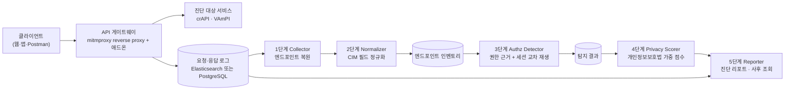

# API 인가 취약점 진단 및 개인정보 노출 영향도 산정 - 아키텍처

## 1. 문서 목적과 범위

이 문서는 최한림 교수의 요구에 따라 아키텍처 계획을 마크다운으로 고정한 것이다. 기획 근거와 선행 연구 비교는 [API 인가 취약점 진단 및 개인정보 노출 영향도 산정](../docs/plan/API%20%EC%9D%B8%EA%B0%80%20%EC%B7%A8%EC%95%BD%EC%A0%90%20%EC%A7%84%EB%8B%A8%20%EB%B0%8F%20%EA%B0%9C%EC%9D%B8%EC%A0%95%EB%B3%B4%20%EB%85%B8%EC%B6%9C%20%EC%98%81%ED%96%A5%EB%8F%84%20%EC%82%B0%EC%A0%95.md), 평가 방법은 [평가 설계](%ED%8F%89%EA%B0%80%20%EC%84%A4%EA%B3%84.md)에 있다. 여기서는 무엇을 어떤 순서로 만드는지만 다룬다.

반영한 외부 요구는 다음과 같다.

- 조재현 교수, 2026-09-21: 산출물을 API 게이트웨이 형태로 낼 것.
- 조재현 교수, 2026-09-21: 계정 A의 리소스를 계정 B 토큰으로 요청해 신원이 다르면 위반이라는 단순 비교는 SNS 프로필 조회처럼 원래 타 사용자 데이터를 보도록 설계된 API를 오탐한다. 추가 확인 로직이 필요하다.
- 최한림 교수, 2026-09-22: 요청과 응답을 별도 시스템으로 로깅해 사후 침해조사에 쓸 것. Elasticsearch, PostgreSQL 등.
- 최한림 교수, 2026-09-22: alias 기반으로 서로 다른 필드명을 통일하는 CIM 개념을 검토할 것. 분류 특화 모델 Jev도 확인할 것.
- 조재현 교수, 2026-09-22: 남아 있는 요청·응답 로그로 접근 API, 호출 횟수, 조회 범위를 확인할 수 있으므로 사후 분석도 제한적으로 다룰 수 있다.

두 번째 지적을 받아 신원 일치나 응답 필드 일치만으로 인가 위반을 확정하지 않는다. 6장은 소수의 권한 근거를 확보한 뒤 확인·검토 후보·보류를 구분한다. 연구 범위 결정과 평가 조건은 [2607.16754 쉬운 정리와 우리 가설](../docs/research/2607.16754%20%EC%89%AC%EC%9A%B4%20%EC%A0%95%EB%A6%AC%EC%99%80%20%EC%9A%B0%EB%A6%AC%20%EA%B0%80%EC%84%A4.md) 7절에 있다. 세 번째와 다섯 번째를 받아 로그 저장소를 독립 구성 요소로 올렸다. 네 번째를 받아 CIM 정규화 단계를 추가했다.

## 2. 시스템 개요

진단 대상 서비스 앞단에 인라인 게이트웨이를 놓는다. 게이트웨이는 mitmproxy 리버스 프록시 모드를 엔진으로 쓰고, 우리 모듈은 애드온으로 붙는다. HTTP 프록시 엔진 자체는 구현하지 않는다.



게이트웨이는 두 모드로 동작한다.

| 모드 | 동작 | 용도 |
|---|---|---|
| 관찰 모드 | 트래픽을 통과시키며 로그에 적재한다 | 1단계 수집, 사후 조회 원본, 운영과 유사한 환경 |
| 진단 모드 | 기록한 요청을 다른 세션으로 재생한다 | 3단계 탐지, 격리된 진단 환경 전용 |

진단 모드는 대상 시스템에 실제 요청을 보내므로 서면 동의를 받은 환경과 자체 구축 벤치마크에서만 켠다.

## 3. 로그 저장소

요청과 응답을 게이트웨이 메모리가 아니라 별도 저장소에 적재한다. 진단 파이프라인과 사후 조회가 같은 원본을 본다.

저장 항목은 다음과 같다.

| 항목 | 용도 |
|---|---|
| 타임스탬프, 클라이언트 IP, 세션 식별자 | 누가 언제 호출했는지 |
| 메서드, 경로, 경로 변수, 쿼리 | 어떤 리소스에 접근했는지 |
| 응답 코드, 응답 필드 경로 목록 | 무엇이 나갔는지 |
| 정규화된 필드 이름 (2단계 산출) | 필드 기반 결합 질의 |
| 응답 본문 | 보관 여부는 미결. 9장 참고 |

저장소는 PostgreSQL을 기본으로 둔다. 구조가 정형이고 필드 기반 결합 질의가 목적이라 관계형이 맞다. 로그량이 늘어 전문 검색이 필요해지면 Elasticsearch를 병행한다.

사후 조회에서 답할 질문은 셋이다.

- 어떤 API가 언제 몇 번 호출됐는가
- 그 호출들이 조회한 리소스 범위가 어디까지인가
- 그 응답에 어떤 개인정보 필드가 실려 나갔는가

이 셋은 로그에 남은 것만으로 답할 수 있다. 응답 본문을 보관하지 않아도 필드 경로 목록과 4단계 분류 결과가 있으면 노출 항목은 특정된다.

## 4. 데이터 흐름

1. 클라이언트 트래픽이 게이트웨이를 지나며 요청과 응답 쌍이 로그 저장소에 적재된다.
2. Collector가 경로 변수를 일반화해 엔드포인트 템플릿을 만들고, 인증 헤더를 세션 컨텍스트로 분리한다.
3. Normalizer가 응답 필드 이름을 공통 스키마로 정규화한다.
4. Detector가 테스트 객체의 공개·비공개·공유 근거와 소유자·타 계정 응답을 대조한다. 근거가 없는 객체는 검토 후보 또는 판정 보류로 남긴다.
5. 확인된 위반의 실제 응답 필드를 Scorer가 개인정보 유형으로 분류하고 법 분류 가중치를 곱해 점수를 낸다.
6. Reporter가 점수 순으로 정렬한 리포트와 기계 판독용 출력을 만든다. 사고 발생 시에는 같은 로그에서 사후 조회 결과를 낸다.

## 5. 구성 요소

### 5.1 Collector (1단계)

- 입력: 로그 저장소의 요청·응답 레코드, 또는 HAR 파일
- 경로 변수 일반화. `/orders/1234`를 `/orders/{id}`로 묶는다
- 인증 헤더, 쿠키, 커스텀 토큰 헤더를 자동 식별해 세션 단위로 분리한다
- 응답 본문에서 필드 경로를 평탄화해 스키마를 만든다. 예: `data.owner.email`
- 출력: 엔드포인트 인벤토리

### 5.2 Normalizer (2단계, CIM 정규화)

서비스마다 같은 의미의 필드를 다른 이름으로 쓴다. `ownerEmail`, `user_email`, `emailAddr`, `mail`이 전부 같은 것이다. 이름마다 분류 규칙을 만들면 사전이 무한히 늘어난다.

- 공통 스키마를 정의한다. `user.email`, `user.phone`, `user.national_id`, `user.address` 같은 형태다. Splunk CIM의 필드 정규화 개념을 따른다
- 관측된 원본 필드 이름을 공통 스키마에 alias로 매핑한다. 규칙으로 잡히지 않는 것만 모델에 넘긴다
- 정규화 결과를 로그 저장소에 함께 적재한다. 필드 기반 결합 질의의 전제가 된다
- 출력: 원본 필드 경로와 정규 이름의 매핑 표

정규화가 있으면 4단계 분류 사전은 공통 스키마 항목 수만큼만 유지하면 된다.

### 5.3 Authz Detector (3단계)

- 정적 프리필터로 모델 호출 대상을 줄인다. 객체 식별자가 없는 엔드포인트, 인증이 필요 없는 엔드포인트는 제외한다
- 세션 교차 재생. 관측된 리소스 식별자를 다른 세션 토큰으로 호출한다
- 객체별 기대 권한의 근거와 타 계정 응답이 요청한 객체를 실제로 반환했는지를 6장 규칙으로 대조한다
- 다른 객체·엔드포인트의 테스트 결과는 검사 대상 선정에 사용한다. 독립적인 금지 근거 없이 위반으로 전파하지 않는다
- 모델은 검토 후보의 정렬을 도울 수 있지만 기대 권한의 증거를 대신하지 않는다
- 출력: 객체·호출자·작업별 판정 등급, 근거, 확인된 노출 필드 목록

### 5.4 Privacy Scorer (4단계)

- 정규화된 필드 이름을 개인정보 유형으로 분류한다. 한국 유형 사전을 직접 만든다. 주민등록번호, 휴대전화번호, 계좌번호, 건강 관련 항목이 대상이다
- 개인정보보호법 분류로 매핑하고 가중치를 부여한다. 고유식별정보와 민감정보를 상위 가중치로 둔다
- 개인정보보호위원회 처분 사례로 가중치 근거를 남긴다
- 출력: 엔드포인트별 영향도 점수와 수정 우선순위

### 5.5 Reporter (5단계)

두 가지 출력을 낸다.

**진단 리포트.** 엔드포인트, 판정 등급, 노출 필드, 점수, 근거 법 조항. 기계 판독용 JSON을 함께 낸다. 판정 근거를 반드시 포함한다. 어떤 필드가 어느 쪽 응답에만 있었는지까지 적는다.

**사후 조회.** 사고가 났을 때 로그 저장소에 질의해 접근된 API, 호출 횟수, 조회된 리소스 범위, 노출된 개인정보 항목을 낸다. 추정하지 않고 로그에 남은 것만 답한다. 로그가 없는 구간은 확인 불가로 표기한다.

## 6. 판정 알고리즘 - 기대 권한 근거와 실제 객체 반환 대조

### 6.1 바뀐 이유

초안은 계정 A의 리소스를 B 토큰으로 호출했을 때 A의 신원이나 같은 필드가 반환되면 위반으로 보았다. 공개 프로필도 같은 응답을 반환할 수 있으므로 이 규칙을 폐기한다. 같은 엔드포인트라도 객체별 공개·공유 상태가 다를 수 있다.

### 6.2 구분 근거

위반을 확인하려면 두 증거가 필요하다. 먼저 해당 객체·호출자 관계·읽기 작업이 금지되어야 한다는 독립적인 근거가 있어야 한다. 테스트 계정이 만든 비공개 객체, 공유 해제 기록, 명시적 테스트 권한 등이 여기에 해당한다. 그다음 금지된 계정의 응답이 요청한 객체의 데이터임을 객체 ID나 테스트용 고유 표식으로 확인한다. 응답 코드 200, 타인 신원, 개인정보 필드, 같은 필드 구성은 그 자체로 기대 권한을 증명하지 않는다.

테스트 객체의 결과는 같은 엔드포인트의 다른 객체를 검사할 순서를 정하는 데 쓴다. 다른 객체의 공개·공유 상태가 독립적으로 확인되기 전에는 위반 판정을 옮기지 않는다. 다른 엔드포인트는 객체 ID가 같아도 별도 읽기 정책이나 필드 권한을 가질 수 있으므로 판정을 자동 전파하지 않는다.

### 6.3 정의

한 검사 사례는 `(엔드포인트, 작업, 객체 ID, 소유자, 시험 계정, 검사 시점)`으로 식별한다. 기대 권한은 `allow / deny / unknown`과 그 출처로 기록한다. 공개·비공개·특정 계정 공유는 객체별 상태로 다룬다. 공유 검증에는 소유자 A와 비공유 B 외에 공유 대상 C가 필요하다.

응답에서 요청 객체의 ID 또는 테스트용 고유 표식이 확인돼야 실제 데이터 반환으로 센다. 정규화된 응답 필드 경로 집합과 개인정보 분류는 **위반 확인 후 노출 범위를 산정**하는 입력이다. 동적 필드와 값 차이를 제거하는 정규화는 영향도 비교에만 쓰고 기대 권한의 증거로 쓰지 않는다.

### 6.4 판정표

| 해당 검사 사례의 근거와 응답 | 판정 | 뜻 |
|---|---|---|
| `deny`가 독립적으로 확인되고 타 계정 응답에서 요청 객체가 확인됨 | 확인된 위반 | 해당 객체·계정·작업의 BOLA 재현 |
| `deny`가 확인되고 401/403 또는 객체 데이터가 없는 거부 응답 | 위반 미재현 | 이 검사 사례에서는 유출을 보지 못함. 엔드포인트 전체의 안전성 증명은 아님 |
| `allow`가 확인되고 해당 객체 반환 | 설계상 허용 | 공개 또는 명시적 공유 사례. BOLA로 표시하지 않음 |
| 기대 권한은 알지만 응답 객체 식별이 안 되거나 응답 구조가 모호함 | 검토 후보 | 실제 객체 반환을 추가 확인해야 함 |
| 기대 권한이나 해당 객체의 공개·공유 상태가 불명확함 | 판정 보류 | 같은 경로의 테스트 객체 결과나 개인정보 존재만으로 확정 불가 |

쓰기 메서드는 응답 본문만으로 판정하지 않는다. 재생 자체가 대상 시스템의 상태를 바꾸므로 기본 차단하고, 아래 조건을 모두 만족할 때만 재생한다. (2026-09-23 조재현 교수 피드백 반영)

**재생 허용 규칙**

- GET, HEAD는 기본 재생 대상이다.
- POST, PUT, PATCH, DELETE는 기본 차단한다. 다음 세 조건을 모두 만족할 때만 재생한다.
  1. 대상 리소스의 소유자가 설정 파일의 테스트 계정 목록에 있다. 관측된 소유자 세션으로 판별한다.
  2. 엔드포인트가 결제 계열 denylist에 걸리지 않는다. 경로에 `pay`, `payment`, `checkout`, `order`, `refund`, `transfer`, `billing`, `card`가 들어가면 제외한다.
  3. 설정에서 해당 엔드포인트의 쓰기 재생을 명시적으로 허용했다.
- 허용된 쓰기 재생은 실행 후 소유자 세션으로 다시 조회한다. 상태가 바뀌었으면 BFLA 위반으로 본다.
- 차단된 쓰기 엔드포인트는 "판정 보류(쓰기 미검증)"로 리포트에 따로 표기한다. 정상으로 처리하지 않는다.

벤치마크 영향: crAPI BFLA 챌린지(`DELETE /identity/api/v2/admin/videos/{video_id}`)는 테스트 계정 소유 영상이 대상이고 denylist에 걸리지 않으므로 허용 규칙 안에서 검증된다. `PUT /workshop/api/shop/orders/{order_id}`는 denylist에 걸려 보류로 나온다.

### 6.5 등급

판정은 확인된 위반, 위반 미재현, 설계상 허용, 검토 후보, 판정 보류로 기록한다. 분모에 검토 후보와 보류를 포함해 자동 확정 범위·오탐률·재현율을 함께 평가한다. 위반 미재현은 검사한 객체·계정·작업에만 적용한다.

### 6.6 모델의 위치와 데이터 반출 원칙

모델은 검토 후보의 분류와 개인정보 항목 추출을 보조한다. 입력은 엔드포인트 경로, 메서드, 정규화된 필드 이름 등 허용된 데이터다. 공개 설계처럼 보인다는 모델 의견은 객체별 기대 권한의 근거가 아니므로 확인된 위반이나 설계상 허용 판정을 만들지 못한다.

**원칙: 응답 본문의 값은 진단 환경 밖으로 나가지 않는다.** 외부 모델에 보내는 것은 필드 이름과 스키마까지다. 값을 봐야 판정되는 건은 로컬 규칙과 로컬 모델로 처리한다.

Jev는 TypeSafe AI가 2026-09-15 공개한 판정 전용 모델로, 텍스트를 생성하지 않고 타입이 정해진 결정과 확률만 반환한다. 다만 **오픈 웨이트와 온프레미스 옵션이 없는 폐쇄 호스티드 API다.** 매 판정이 외부 엔드포인트 왕복이므로 로컬 실행 전제는 성립하지 않는다. 위 원칙에 따라 Jev를 쓴다면 필드 이름만 보내는 경로로 제한한다. 값까지 넣어야 하는 분류는 GLiFormer 기반 `jeff`나 SemIf 같은 셀프호스팅 대체재로 돌린다. 둘 중 무엇을 쓸지는 9장 미결이다.

(as of 2026-09-22, https://simonwillison.net/2026/Sep/21/jev/, https://github.com/logan-markewich/jeff)

모델 의견은 확정 판정을 뒤집지 못한다. 검토 후보의 우선순위 제안과 근거를 별도로 남긴다.

## 7. 인터페이스

### 7.1 엔드포인트 인벤토리

```json
{
  "endpoint": "GET /identity/api/v2/vehicle/{vehicleId}/location",
  "params": {"path": ["vehicleId"], "query": []},
  "auth": {"type": "bearer", "header": "Authorization"},
  "observed_sessions": ["userA", "userB"],
  "response_fields": ["vehicleLocation.latitude", "ownerEmail", "fullName"],
  "normalized_fields": ["geo.latitude", "user.email", "user.name"]
}
```

### 7.2 탐지 결과

```json
{
  "endpoint": "GET /identity/api/v2/vehicle/{vehicleId}/location",
  "resource_id": "a1b2c3",
  "owner_session": "userA",
  "tested_session": "userB",
  "expected_access": "deny",
  "expectation_evidence": "테스트 객체의 비공개 설정과 비공유 상태",
  "status_code": 200,
  "returned_object_confirmed": true,
  "verdict": "확인된 위반",
  "rule": "기대 권한 deny + 요청 객체 실제 반환",
  "leaked_fields": ["user.email", "user.name", "geo.latitude"],
  "model_opinion": null
}
```

### 7.3 영향도 점수

```json
{
  "endpoint": "GET /identity/api/v2/vehicle/{vehicleId}/location",
  "score": 82,
  "classified": [
    {"field": "user.email", "type": "개인정보", "weight": 3},
    {"field": "user.name", "type": "개인정보", "weight": 3},
    {"field": "geo.latitude", "type": "위치정보", "weight": 5}
  ],
  "priority": 1
}
```

### 7.4 사후 조회 결과

```json
{
  "window": {"from": "2026-09-20T00:00:00Z", "to": "2026-09-21T00:00:00Z"},
  "endpoint": "GET /identity/api/v2/vehicle/{vehicleId}/location",
  "call_count": 1842,
  "distinct_resources": 1790,
  "sessions": ["userB"],
  "exposed_fields": ["user.email", "user.name", "geo.latitude"],
  "note": "응답 본문 미보관. 필드 목록은 스키마 기준"
}
```

네 스키마의 필드 이름은 4단계와 5단계 착수 전에 고정한다.

## 8. 평가와의 연결

[평가 설계](%ED%8F%89%EA%B0%80%20%EC%84%A4%EA%B3%84.md)의 기존 입력량 비교는 갱신이 필요하다. 사람은 테스트 계정과 소수 객체의 공개·비공개·공유 근거를 준비한다. 전체 권한표는 입력하지 않지만 정답 입력이 0이라는 주장도 하지 않는다.

[2607.16754 쉬운 정리와 우리 가설](../docs/research/2607.16754%20%EC%89%AC%EC%9A%B4%20%EC%A0%95%EB%A6%AC%EC%99%80%20%EC%9A%B0%EB%A6%AC%20%EA%B0%80%EC%84%A4.md) 7절에 따라 객체별로 표시한 사례와 미표시 사례를 분리한다. 같은 엔드포인트의 미표시 객체에 독립적인 권한 단서가 있을 때까지 얼마나 판정 가능한지 측정하고, 다른 엔드포인트 전파는 탐색적으로 보고한다. 전체 위반 재현율(보류한 실제 위반 포함), 확인 판정 정밀도, 공개·공유 오탐률, 판정 보류율, 사람 설정 시간, 추가 요청 수를 함께 공개한다. crAPI·VAmPI는 추가 읽기 BOLA 재현에 쓰고 공개·비공개·공유 조합은 자체 API로 평가한다.

## 9. 범위 밖

- 운영 트래픽 처리 성능과 고가용성. mitmproxy는 그 목표를 갖는 도구가 아니다
- 인증 자체의 취약점, 레이트 리밋, 인젝션, SSRF
- 동의 없는 외부 서비스 진단. 자체 구축 환경과 공개 취약 앱으로 한정한다
- 결제 계열 엔드포인트의 쓰기 인가 검증. denylist로 재생하지 않으므로 판정 보류로만 보고한다
- 침해 시나리오와 인프라 구성을 사람이 입력받아 수행하는 완전한 사고 조사. 사후 분석은 로그에 남은 범위로 제한한다

## 10. 미결 사항

| 항목 | 상태 |
|---|---|
| 응답 본문 보관 여부와 보관 기간 | TBD, 보관하면 조사 정확도가 오르고 유출 위험도 오른다 |
| 로그 저장소를 PostgreSQL 단독으로 갈지 Elasticsearch 병행할지 | TBD, 로그량 실측 후 결정 |
| CIM 공통 스키마 항목 목록 | TBD |
| alias 매핑 자동 생성을 규칙으로 할지 모델로 할지 | TBD |
| Jev API 경로와 셀프호스팅 대체재 중 무엇을 쓸지 | TBD, 필드명만으로 판정 정확도가 나오는지 테스트 후 결정 |
| 로그 저장소에서 필드 기반 결합 질의가 실제로 성립하는지 | TBD, 최한림 교수 요청 검증 항목 |
| 필드 경로 평탄화 규칙 (배열 인덱스 처리) | TBD |
| 변동 필드 제외 목록의 산정 방식 | TBD |
| 개인정보 유형별 가중치 수치 | TBD, 처분 사례 수집 후 확정 |
| 기계 판독 출력 포맷을 SARIF로 맞출지 여부 | TBD |
| 검토 필요 등급의 목표 비율 | TBD, 1차 실험 후 설정 |

## 11. 교수 피드백 대응 요약

| 지적 | 대응 | 반영 위치 |
|---|---|---|
| API 게이트웨이 형태로 나오면 좋겠다 | mitmproxy 리버스 프록시를 인라인 게이트웨이로 두고 관찰 모드와 진단 모드를 분리했다 | 2장 |
| 원래 타 사용자 데이터를 보여주는 API가 있어 단순 신원 비교는 오탐한다 | 객체별 기대 권한의 독립 근거와 실제 반환을 함께 확인한다. 근거가 없으면 보류한다 | 6장 |
| 다양한 케이스를 고려해야 한다 | 상태 변경 메서드는 재조회로 확인하고, 응답 구조가 다른 경우와 비교군이 없는 경우를 별도 판정으로 분리했다 | 6.4 |
| 진단 재전송이 결제 같은 부작용을 낼 수 있다 (2026-09-23) | 쓰기 메서드를 기본 차단하고 테스트 계정 소유 리소스, 결제 계열 denylist 제외, 명시 허용의 세 조건을 모두 만족할 때만 재생한다. 차단 건은 판정 보류로 표기한다 | 6.4 |
| 요청과 응답을 별도 시스템으로 로깅해 사후 침해조사에 쓸 것 | 로그 저장소를 독립 구성 요소로 올리고 Reporter에 사후 조회 출력을 추가했다 | 3장, 5.5, 7.4 |
| alias 기반 필드 통일, CIM 개념 | Normalizer를 2단계로 신설하고 정규화 이름을 비교와 분류의 기준으로 삼았다 | 5.2, 6.3 |
| Jev 확인, 로컬 사용 가능한지 | 확인 결과 오픈 웨이트와 온프레미스가 없는 폐쇄 API다. 필드명만 보내는 경로로 제한하거나 셀프호스팅 대체재를 쓴다 | 6.6 |
| 사후 분석은 로그로 제한적으로 가능하다 | 사후 조회가 답하는 질문 세 가지를 명시하고 확인 불가 구간을 표기하게 했다 | 3장, 5.5 |

---

관련: [API 인가 취약점 진단 및 개인정보 노출 영향도 산정](../docs/plan/API%20%EC%9D%B8%EA%B0%80%20%EC%B7%A8%EC%95%BD%EC%A0%90%20%EC%A7%84%EB%8B%A8%20%EB%B0%8F%20%EA%B0%9C%EC%9D%B8%EC%A0%95%EB%B3%B4%20%EB%85%B8%EC%B6%9C%20%EC%98%81%ED%96%A5%EB%8F%84%20%EC%82%B0%EC%A0%95.md), [평가 설계](%ED%8F%89%EA%B0%80%20%EC%84%A4%EA%B3%84.md), [선행 솔루션 조사](../docs/plan/%EC%84%A0%ED%96%89%20%EC%86%94%EB%A3%A8%EC%85%98%20%EC%A1%B0%EC%82%AC.md), [법적 근거](../docs/plan/%EB%B2%95%EC%A0%81%20%EA%B7%BC%EA%B1%B0.md)
