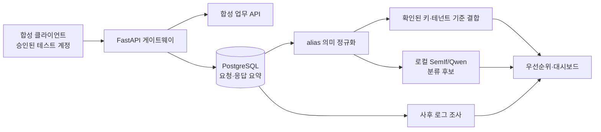

# API 보안 게이트웨이 데모 해석과 상세 설명

이 문서는 `양유상/데모코드/`를 실행했을 때 무엇을 관찰해야 하는지, 그 결과를 프로젝트 주장으로 어디까지 해석할 수 있는지를 정리한 발표·회의용 문서입니다. 데모는 실제 서비스나 실제 침해사고가 아니라, 승인된 합성 API와 가상 계정으로 만든 PoC입니다.

## 1. 프로젝트가 답하려는 질문

교수님 피드백을 구현 질문으로 바꾸면 다음 네 가지입니다.

1. 요청과 응답을 별도로 남겨 두면 사고 뒤에 어떤 API가 누구에게 무엇을 반환했는지 다시 확인할 수 있는가?
2. `member_id`와 `customer_no`처럼 이름이 다른 필드를 공통 의미로 묶을 수 있는가?
3. 공통 식별자·테넌트·실행 범위가 확인된 경우, 여러 API의 반환 필드를 한 사건으로 결합할 수 있는가?
4. 한국어 문맥이 필요한 개인정보 후보를 로컬 모델로 분류하되, 잘못된 자동 법률 판단을 막을 수 있는가?

데모는 이 질문을 하나의 거대한 AI 기능으로 뭉개지 않습니다. 관측·정책 판정·정규화·결합·AI 후보 분류를 각각 기록하고, 마지막 화면에서 근거를 다시 따라갈 수 있게 합니다.

## 2. 전체 흐름



`gateway/`는 요청을 합성 업무 API로 전달하고 추적 ID·요청자·대상·응답 필드·정책 판정을 저장합니다. `gateway/privacy.py`의 alias 매핑은 원본 필드 경로를 버리지 않고 공통 의미 후보를 붙입니다. `gateway/store.py`는 같은 실행, 요청자, 테넌트, 확인된 회원 체계를 벗어난 행을 임의로 합치지 않습니다. `ml_jev/`는 모델 결과를 검토 후보로만 반환하며 게이트웨이의 허용·차단 결정을 바꾸지 않습니다.

## 3. 화면 시연 순서

### A. 인가 취약점과 정상 사례

1. `양유상/데모코드`에서 `./start-demo.ps1 -WithModel`을 실행합니다.
2. `http://127.0.0.1:8810`에 접속해 취약 모드 실행을 누릅니다.
3. 비공개 프로필, 상담 내용, 관리자 export, 다른 테넌트 접근 사례의 요청과 응답을 엽니다.
4. 공개 프로필·공유 문서·관리자 정상 접근에는 경보가 생기지 않는 것을 확인합니다.
5. 수정 모드를 다시 실행해 같은 사례에서 확인된 위반이 제거되고 정상 경로가 유지되는지 확인합니다.

이 단계에서 신원 필드가 다르다는 사실만으로 BOLA를 확정하지 않습니다. 공개 조회 API처럼 타인 프로필을 보여 주도록 설계된 API가 있기 때문에, 승인된 정책의 허용 필드·객체 범위·실제 반환 자료를 함께 비교합니다. 단순 HTTP 200이나 응답의 이름 하나도 성공 또는 취약점의 단독 증거로 쓰지 않습니다.

### B. 남아 있는 로그로 사고 뒤를 조사하기

`http://127.0.0.1:8810/#incidents`에서 실행 `incident-4bf3904446c9`와 계정 `bob`을 선택합니다.

실제 저장 기록에서 다음을 확인할 수 있습니다.

| 저장된 관측 | 데모에서 보이는 값 | 의미 |
|---|---:|---|
| 호출 수 | 13 | 해당 실행에 기록된 호출 수 |
| 서로 다른 API | 8 | 접근 경로의 범위 |
| HTTP 2xx | 11 | 성공 응답으로 기록된 호출 수 |
| 정책 위반 근거가 있는 응답 | 7 | 저장된 판정·반환 필드와 연결된 응답 |
| 관측 정보주체 | 3 | 확인된 키 범위에서 중복 제거한 수 |

이 수치는 전체 공격 호출 수나 실제 피해자 전체 수가 아닙니다. 게이트웨이를 통과해 기록된 합성 실행의 관측 범위입니다. `metadata_only` 보기를 선택하면 요청 메타데이터는 남아도 반환 필드·조회 인원·정책 위반 요청 수가 `알 수 없음`으로 표시됩니다. 이는 로그에 무엇이 없을 때 과도하게 0으로 결론 내리지 않는지 확인하는 시연입니다.

조사 결과는 저장된 DB를 다시 읽어 생성합니다. 사고 조사 화면을 보기 위해 업무 API를 재호출하거나 모델을 다시 추론하지 않습니다. CLI로도 같은 결과를 저장할 수 있습니다.

```powershell
./venv/Scripts/python.exe -X utf8 scripts/export_incident.py `
  --run incident-4bf3904446c9 --actor bob
```

### C. alias와 DB 결합

대시보드의 매핑 탭에서 `member_id`·`customer_no`, `phone`·`mobile_no` 같은 별칭이 같은 공통 의미 후보로 정규화되는 과정을 봅니다. 이 작업은 Splunk CIM 호환을 인증하는 기능이 아니라, 프로젝트가 정한 공통 스키마를 실험하는 단계입니다.

정규화와 동일인 결합은 분리해서 해석해야 합니다.

- 정규화: 두 필드 이름과 서비스 계약이 같은 의미인지 후보를 만든다.
- 결합: 확인된 식별자 영역·테넌트·실행 범위가 일치할 때만 여러 응답을 묶는다.
- 법적 특정성: 공격자가 실제로 같은 보조 정보를 얻을 수 있었는지, 시간·비용·기술을 고려해야 하므로 자동 결론으로 만들지 않는다.

예를 들어 alpha 테넌트의 `U100`과 beta 테넌트의 `U100`은 같은 문자열이어도 하나의 사람으로 합치지 않습니다. 이름 문자열만 같은 행도 자동으로 연결하지 않습니다.

### D. 한국어 개인정보 분류 실험실

`./start-demo.ps1 -WithJev`로 시작한 뒤 `http://127.0.0.1:8810/privacy-lab`를 엽니다.

1. 96개 동결 사례에서 건강·종교·연락처·고유식별정보·이름·계정 식별자·기타·불명 라벨을 선택합니다.
2. 필드명·설명·값을 그대로 분류합니다.
3. `schema_only`와 `value_only`로 바꾸어 어떤 입력 정보가 판단에 영향을 주는지 비교합니다.
4. 8개 상대 점수, raw evidence, 처리 시간, 검토 후보 상태를 확인합니다.
5. 저장된 평가 탭에서 방법별 혼동행렬과 높은 점수 오분류를 엽니다.

입력을 수정하면 원래 사례의 정답과 자동 비교하지 않습니다. 수정된 문장에 임의로 정답을 붙여 성능을 부풀리지 않기 위한 동작입니다.

## 4. 실제 측정 결과와 해석

### 한국어 96건 비교

| 방법 | 실행 건수 | 정답 | 정확도 | 해석 |
|---|---:|---:|---:|---|
| SemIf 선택지 점수 방식 + 로컬 Qwen3 4B | 96 | 82 | 85.4% | 이번 데모의 실제 로컬 모델 경로 |
| 같은 GGUF의 제약 JSON 출력 | 96 | 81 | 84.4% | 출력 형식이 다른 비교군 |
| 사전·정규식 기준선 | 96 | 73 | 76.0% | 빠른 결정론적 기준선 |

세 방법은 모두 96건을 실행했고 실행 오류는 없었습니다. 그러나 SemIf와 JSON의 차이는 한 건뿐입니다. 이 자료로 특정 구현이나 모델이 본질적으로 우수하다고 결론 내리지 않습니다.

SemIf의 대표적인 관찰은 다음과 같습니다.

- 14개 오분류 중 12개가 상대 점수 90% 이상이었다. 높은 점수는 정답 확률이 아니다.
- 대조쌍 14개 중 두 입력을 모두 맞힌 쌍은 8개였다. 문맥 변화에 대한 안정성은 더 평가해야 한다.
- 일반적인 `OTHER` 사례의 재현율은 6/12였다.
- 프롬프트 주입 형태의 합성 문장은 8개 중 3개만 맞혔다. 데이터 안의 지시문을 안전하게 무시한다고 주장할 수 없다.
- `schema_only`의 여권번호 설명 사례는 `GOVERNMENT_ID`로 분류됐지만, 값만 보낸 `value_only` 사례는 `ACCOUNT_ID`로 잘못 분류됐다. 별도 입력 모드 시연의 의미 일치는 3건 중 2건이다.

`score`는 선택지 사이의 조건부 상대 선호도입니다. 교정된 확률, 개인정보보호법 점수, 위험도 점수, 자동 승인 신호가 아닙니다. 실제 경로에서는 `status=needs_review`를 유지하고 사람이 확인합니다.

### 사전 진단과 사후 조사의 차이

사전 진단은 테스트 계정으로 요청을 실제 수행하고 승인된 정책과 반환 자료를 비교합니다. 결과는 “이 조건에서 이 API가 이 필드를 반환했다”는 재현 가능한 발견입니다.

사후 조사는 이미 남은 요청·응답 로그에서 접근 API, 호출 횟수, 반환 범위, 관측 주체를 재구성합니다. 로그가 불완전하면 `unknown`으로 남깁니다. 이 결과는 “전체 사고 피해 규모”가 아니라 “보존된 증거로 확인 가능한 하한·범위”입니다.

두 기능은 같은 PostgreSQL 기록을 사용할 수 있지만, 사전 진단의 정책 기대값과 사후 조사의 관측값을 같은 숫자로 합치지 않습니다.

## 5. 교수님 피드백과 구현 대응

| 피드백 | 구현 | 데모에서 확인할 것 |
|---|---|---|
| 요청·응답을 별도 로깅 | 추적 ID·요청자·대상·응답 필드·판정을 PostgreSQL에 저장 | 이벤트 목록과 실행별 증거 ID |
| 사고 뒤 로그 조사 | 저장 기록만 읽는 조사 API·CLI | full/metadata-only 범위 차이 |
| alias 기반 CIM 개념 | 원본 경로를 보존한 공통 필드 후보 매핑 | 매핑 근거와 원본 필드 |
| 로컬 Jev 계열 분류 | SemIf 선택지 점수 + Qwen3 4B 실행 | 8개 점수·raw 결과·오분류 |
| DB에서 필드 결합 | 확인된 키·테넌트·실행 범위로 SQL 결합 | 동일 주체 필드 합집합 |
| 공개 조회 API 오탐 방지 | 신원 불일치 단독 판정 금지, 허용 필드·객체 정책 비교 | 공개/공유/관리자 정상 사례의 무경보 |

## 6. 이 데모가 증명하는 것과 증명하지 않는 것

### 증명하는 범위

- 합성 API 요청과 응답을 별도로 요약해 PostgreSQL에 저장하는 연결이 동작한다.
- 저장된 과거 기록을 재호출 없이 조회·집계하고, 로그가 부족할 때 `unknown`을 유지할 수 있다.
- 승인된 alias 후보와 확인된 식별자 범위 안에서 여러 응답의 필드를 결합할 수 있다.
- 로컬 모델을 외부 추론 API 없이 실행하고, 결과·점수·모델 해시·프롬프트 계약을 증거로 남길 수 있다.
- 결정론적 정책 판정과 AI 후보 분류를 분리할 수 있다.

### 증명하지 않는 범위

- 모든 API의 BOLA/BFLA/BOPLA를 자동으로 찾는다는 것
- 공식 TypeSafe Jev 또는 다른 상용 제품과 동일한 품질·속도라는 것
- 합성 96건의 정확도가 실제 한국어 개인정보·법률 분류 정확도라는 것
- 필드명 조합만으로 개인정보보호법상 특정 가능성을 확정한다는 것
- 확인된 테스트 응답 수를 실제 사고의 전체 피해자·전체 유출량으로 확대하는 것
- 인증·TLS·권한 분리·보존 기간·운영 부하·장애 복구가 완료됐다는 것

## 7. 4인 프로젝트로 이어 갈 때의 우선순위

1. **정책·데이터 계약 담당**: 서비스별 공개/비공개/공유/역할/테넌트 정책과 필드 허용 목록을 버전 관리합니다.
2. **게이트웨이·로그 담당**: 요청·응답 이벤트 계약, 민감값 마스킹, 연결 ID, 보존 기간, DB 장애 처리와 재시도 정책을 고정합니다.
3. **분류·정규화 담당**: 규칙·모델 후보를 분리하고, 사람이 라벨링한 독립 검증셋에서 문맥·alias·프롬프트 주입 슬라이스를 평가합니다.
4. **조사·UI·검증 담당**: 사전 진단과 사후 조사를 분리한 화면, 근거 링크, 혼동행렬, unknown/needs_review 상태, 회귀 시나리오를 유지합니다.

첫 학기 목표는 법률 판단 자동화가 아니라 **근거를 남기는 인가 검증과 개인정보 후보 검토 보조**로 고정하는 것이 안전합니다. 독립 평가셋·현업 정책 검토·마스킹/보존 설계가 끝난 뒤에만 자동화 범위를 넓힙니다.

## 8. 근거 파일 위치

- 통합 PoC 결과: `데모코드/evidence/integration-tests.json`, `데모코드/docs/demo-results.md`
- 사후 조사 결과: `데모코드/evidence/investigations/`, `데모코드/evidence/incidents/`, `데모코드/docs/incident-demo.md`
- 한국어 평가: `데모코드/evidence/jev/evaluation.json`, `데모코드/evidence/jev/final-audit.json`, `데모코드/docs/korean-jev-results.md`
- 입력 모드 비교: `데모코드/evidence/jev/input-modes-20260922T052854Z.jsonl`
- 화면·실제 브라우저 검증: `데모코드/evidence/jev/ui/`
- 조사 출처와 원본 첨부: `조사/api-gateway-research-2026-09-21/`, `조사/source-materials/`

실행 결과의 날짜·해시·모델 identity는 각 증거 JSON을 기준으로 확인합니다. 문서의 설계 제안과 실제로 실행된 기능을 같은 상태로 읽지 않습니다.
