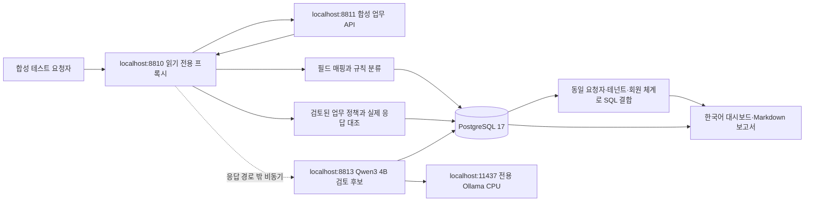

# API 노출 분석 실험실 아키텍처

이 문서는 2026-09-22 교수 피드백을 반영한 실행 데모의 설계다. 이전 조사 문서의 APISIX 제안과 달리 **이번 실험의 HTTP 수집 지점은 FastAPI + HTTPX로 만든 제한된 로컬 프록시**다. mitmproxy/APISIX 운영 플러그인을 실행했다고 주장하지 않는다.

## 데이터 흐름

## 교수 피드백의 구현 지점

| 피드백 | 실제 구현 | 범위 경계 |
|---|---|---|
| 요청·응답을 별도 저장 | PostgreSQL events, findings, observations, runs, model_results | 응답 구조·분류·서비스 식별자 보존. 개인정보 값은 마스킹. 원문 전체 복원은 불가 |
| CIM 방식 필드 통일 | 역할·네임스페이스를 가진 reviewed mapping registry, 로컬 AI 후보 | Splunk 설치나 공식 CIM 전체 준수는 아님 |
| Jev 같은 로컬 분류 가능성 검증 | 0.6B 선택지 점수와 1.7B/4B JSON 생성 비교; 시연은 4B 사용 | 공식 Jev/SemIf 실행이 아니며 속도·정확도를 대신 입증하지 않음 |
| DB 기록 결합 | PostgreSQL SQL GROUP BY로 같은 요청자에게 노출된 필드/엔드포인트 연결 | 동일인 연결과 법적 식별 가능성 확정은 별개 |
| 사후 사고 조사 | 실행별 타임라인, 증거 ID, 응답 항목, Markdown 보고서 | 현재 게이트웨이에서 기록된 범위만 관측. 전체 침해경로 추정 아님 |

## 분리하는 신원

- actor: 인증된 요청자. 로컬 실험용 토큰 사전에서 결정한다.
- data_subject: 실제 응답의 회원 정보 주체. 계약상 확인된 필드에서 추출한다.
- resource.owner: 공유 문서 소유자. actor와 같지 않아도 정상 접근할 수 있다.
- resource.order.id: 주문 식별자. 개인정보보호법의 고유식별정보로 분류하지 않는다.
- tenant + namespace + subject_id: 연결 키. 값 U100만으로 조직을 넘어 합치지 않는다.

## 판정 상태

| 상태 | 조건 |
|---|---|
| confirmed | 검토 완료 정책의 거부/필드 금지 조건 + 실제 대상 응답 데이터 증거 |
| allowed | 소유자·공개 필드·관리자·공유 조건에 맞는 정상 응답 |
| blocked | 정책상 거부 대상이 실제 401/403으로 차단됨 |
| needs_review | 정책 미제공, 객체 대응 불명확, 예상 밖 오류/응답 |

LLM은 인가 위반을 확정하지 않는다. HTTP 200, 신원 불일치, 개인정보 포함이라는 조건 각각만으로 위반을 확정하지 않는다. 승인된 정책 자체가 틀렸을 가능성은 별도 문제이며 실제 적용 전 서비스 담당자 검토가 필요하다.

분류·필드 통일은 8813 작업자가 담당하고, 8812는 실패 결과를 비교하는 0.6B 작업자다. 4B의 일반 건강 안내 오분류와 추가 회원 식별자 설명에 대한 unknown 보류를 실제 기록했다. 승인된 필드 매핑 12개는 사람이 검토한 데모 계약이며 모델의 제안을 자동 반영하지 않는다.

## 결합 분석

분석 단위는 **현재 실행 + 같은 요청자 + 같은 테넌트 + 같은 회원 체계 + 같은 회원번호**다. confirmed 응답에 포함된 관측만 대상으로 한다. 관리자가 받은 데이터와 일반 회원이 받은 데이터를 섞지 않는다. 서로 다른 API 2개 이상에 등장한 사람만 결합 결과에 표시한다.

스키마만으로는 의미 매핑·결합 후보를 제안할 수 있다. 실제 같은 사람인지 확인하려면 로컬 값과 신뢰 가능한 관계가 필요하다. 내부 DB가 아는 정보와 공격자가 받은 정보를 구분해야 한다. 법적 식별 가능성은 외부 정보 입수 가능성·시간·비용·기술 등을 추가 고려한다.

## 보안·운영 범위

- 모든 프로세스는 127.0.0.1에 바인딩. 별도 PostgreSQL 컨테이너/볼륨/15439 포트만 사용한다.
- API 진단 대상은 이 프로젝트의 합성 서버뿐이며 임의 URL을 입력받지 않는다.
- 자동 테스트는 GET 16개 사례로 한정한다. 운영 서비스에 계정 교환 재전송하지 않는다.
- Authorization/Cookie/password 등 비밀은 로그에 그대로 쓰지 않는다. uvicorn access log도 꺼 쿼리 문자열 유출을 줄인다.
- 데이터는 모두 합성이고 연락처/주소/문장도 실서비스 자료가 아니다. 개인정보 원문 값은 대시보드 기록에서 마스킹한다.
- SHA-256은 우발적 변경 확인용이다. 증거 서명이나 외부 해시 고정 없이 악의적인 DB 관리자에 대한 변조 방지는 주장하지 않는다.
- DB 장애는 현재 프록시 요청을 실패시킬 수 있다. 고가용성·비동기 내구 큐·재처리·로그 손실 계측은 다음 단계다.
- 데모에서는 PostgreSQL 연결 풀(min 1/max 4)을 사용하고 연결/풀 실패는 503 및 증거 저장 미확인으로 반환한다. 이것이 고가용성을 보장하지는 않는다.
- 로컬 모델 분석은 응답 경로 밖에서 실행한다. 현재 메모리 작업 큐는 프로세스 종료 시 유실될 수 있어 운영용 큐가 필요하다.
- 데모 관리자 화면에는 운영 인증이 없다. 조직망에 공개하지 않는다.
- DB 암호는 합성 로컬 실습 전용이다. 운영 배포 전 계정 분리, 비밀 관리, 암호화, 보존/삭제 정책을 구현해야 한다.

## 다음 개발 구조

사후 분석의 추가 실행 데모는 [사후 로그 분석](incident-demo.md)을 따른다. `gateway/incident.py`는 기존 DB를 `REPEATABLE READ, READ ONLY`로 조회해 모든 호출의 API·횟수·상태·반환 대상을 집계한다. `/api/incidents/demo/prepare`의 합성 로그 생성과 `/api/incidents/analyze`의 읽기 전용 분석을 분리했다. 분석 경로는 업무 API나 로컬 모델을 재호출하지 않는다. UI의 여섯 번째 탭에서 응답 증거가 있을 때와 요청 메타데이터만 사용할 때를 비교한다.

1. 인가 엔진 담당: 정책 등록·공유/조직/역할·기능/필드 권한과 회귀 테스트.
2. 데이터 담당: gateway addon, 비동기 로그, 개인정보 최소화, DB 관측과 연결.
3. 모델 담당: 한국어 평가셋, 규칙/모델 비교, CIM 후보, 불확실성 관리.
4. 제품·검증 담당: 증거 중심 UI, 통합 시나리오, 재현 환경, 성능·위협 모델.

데모의 성공 기준은 연결된 구조가 실제 실행되고 핵심 반례를 구분하는지다. 제품 성능이나 범용 탐지 정확도가 입증되는 것은 아니다.
