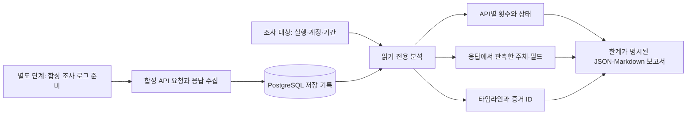

# 남은 요청·응답 로그를 이용한 제한적 사후 분석 데모

교수님의 추가 피드백인 **“남은 로그로 접근 API, 호출 횟수, 조회 범위 등 확인 가능한 정보를 조사한다”**를 구현했다. 사후 분석은 이미 PostgreSQL에 저장된 기록을 읽는다. 새로운 취약점 진단 요청을 보내거나 LLM을 다시 실행하지 않는다.

## 화면에서 시연하기

1. [사후 로그 분석 화면](http://127.0.0.1:8810/#incidents)을 연다.
2. 저장된 실행 `incident-4bf3904446c9`, 요청 계정 `bob`, 로그 증거 `저장된 응답 증거 포함`을 선택하고 **저장 로그 분석**을 누른다.
3. 호출 수, API별 집계, 정보주체, 타임라인을 살펴본다. 증거 ID를 누르면 해당 시점에 저장한 마스킹 응답과 판정 근거를 볼 수 있다.
4. `profile/private/U999` 요청을 확인한다. URL에 대상 ID가 있으나 응답은 HTTP 404이므로 반환된 정보주체에 포함하지 않는다.
5. 로그 증거를 **요청 메타데이터만 남은 경우**로 바꾸고 다시 분석한다. 호출 수와 경로는 남지만, 실제 반환 항목·정보주체·정책 위반 요청 수는 **알 수 없음**으로 바뀐다.
6. **조사 보고서 .md**로 현재 선택 범위의 보고서를 내려받는다.

화면 아래 **합성 조사 로그 준비**는 새로운 합성 요청 14건을 실제로 보내는 별도 단계다. 저장 로그 분석 버튼은 이미 수집한 기록만 읽는다. 기존 실행을 조사할 때 준비 버튼을 다시 누를 필요가 없다.

## 실제 저장 기록에서 확인한 결과

2026-09-22 생성한 실행 `incident-4bf3904446c9`를 직접 DB에서 조회했다. 전체 기록은 Bob 13건과 정상 관리자 1건이다. 아래 집계는 Bob만 선택한 결과이며, 관리자의 정상 요청은 섞이지 않는다.

| 확인 항목 | 남아 있는 기록에서 확인한 값 | 의미 |
|---|---:|---|
| 요청 로그 | 13건 | 반복 호출도 각각 포함 |
| 접근 API 유형 | 8개 | 명시된 데모 경로 계약으로 변수 부분을 정규화 |
| HTTP 2xx | 11건 | HTTP 처리 성공 수이며 조회 인원과 다름 |
| HTTP 403 | 1건 | 비공개 문서 접근 거부 |
| HTTP 404 | 1건 | U999 조회 시도, 반환 정보주체 없음 |
| 저장된 정책 위반 근거가 있는 응답 | 7건 | 등록된 인가 정책·저장 판정·응답 증거를 함께 확인 |
| 응답에서 관측한 중복 제거 정보주체 | 3개 | 테넌트·회원 체계·식별자를 함께 사용 |
| 위반 응답에서 확인한 정보주체 | 3개 | 해당 기록의 관측 범위이며 전체 피해자 추정치가 아님 |

첫 관측 시각은 `2026-09-22T03:04:03.094944+00:00`, 마지막 관측 시각은 `2026-09-22T03:04:04.531306+00:00`다. 한국 시각으로 각각 12:04:03과 12:04:04이며, 합성 시연을 위해 짧은 시간에 생성했다. 실제 사고의 공격 속도를 측정한 값이 아니다.

| API | 호출 | HTTP 2xx | HTTP 403 | HTTP 404 | 정책 위반 근거가 있는 응답 | 저장 증거 ID |
|---|---:|---:|---:|---:|---:|---|
| `GET profile/private/{member_id}` | 4 | 3 | 0 | 1 | 2 | 243, 244, 245, 246 |
| `GET consultations/{member_id}` | 2 | 2 | 0 | 0 | 2 | 247, 248 |
| `GET profile/public/{member_id}` | 1 | 1 | 0 | 0 | 0 | 249 |
| `GET documents/private` | 1 | 0 | 1 | 0 | 0 | 250 |
| `GET admin/export` | 2 | 2 | 0 | 0 | 2 | 251, 252 |
| `GET tenants/{tenant_id}/profile/{member_id}` | 1 | 1 | 0 | 0 | 1 | 253 |
| `GET ambiguous/{member_id}` | 1 | 1 | 0 | 0 | 0 | 254 |
| `GET info/health` | 1 | 1 | 0 | 0 | 0 | 255 |
| 합계 | **13** | **11** | **1** | **1** | **7** | |

`ambiguous/{member_id}`는 정책 미확정 검토 건이다. 표의 위반 근거 수가 0이라고 정상 접근을 입증한 것은 아니다. 공개 프로필, 본인 조회, 정책 미확정 경로, 거부 응답을 무조건 유출로 합치지 않는다.

정보주체는 `alpha:synthetic-member-v1:U100`, `alpha:synthetic-member-v1:U200`, `beta:synthetic-member-v1:U100`이다. `U100` 문자열이 같아도 다른 테넌트의 회원은 분리한다. 반복 응답에서 같은 회원이 등장해도 중복 제거 인원은 증가하지 않는다.

정보주체의 **전체 관측 항목**(`fields`)은 선택 범위에서 해당 정보주체에 관해 실제 반환된 필드의 합집합이다. 정상 접근·공개 응답에서 관측한 필드도 들어갈 수 있다. **비인가 응답 관측 항목**(`confirmed_fields`)은 그중 정책 위반 근거가 확인된 응답에서 관측한 항목만 모은다. 이 두 목록을 분리하고, `confirmed_event_ids`와 해당 이벤트의 응답으로 근거를 확인한다. 현재 사례의 alpha:U100에는 회원 정보와 상담 항목이 서로 다른 응답에서 관측된다.

## 응답이 남지 않은 상황과 비교하기

`metadata_only`는 원본 자료를 삭제하는 실험이 아니다. 같은 요청 기록에서 응답·저장 판정·필드 관측·모델 결과를 분석에 사용하지 않는 비교 모드다.

| 항목 | 응답 증거 포함 | 요청 메타데이터만 사용 |
|---|---|---|
| 요청 계정·경로·시각·상태 | 확인 가능 | 확인 가능 |
| 호출 13건·API 8종 | 확인 가능 | 동일하게 확인 가능 |
| URL에 적힌 조회 시도 대상 | 확인 가능 | 확인 가능 |
| 실제 반환된 정보주체 3개 | 응답 증거로 확인 | 알 수 없음 (`null`) |
| 실제 반환 항목 | 마스킹 응답·관측 필드로 확인 | 알 수 없음 |
| 정책 위반 근거가 있는 응답 7건 | 저장 정책·판정·응답으로 확인 | 알 수 없음 (`null`) |
| 실제 전체 공격 호출 수·전체 피해 규모 | 알 수 없음 | 알 수 없음 |

로그가 없거나 응답이 없다는 사실을 0건 노출로 바꾸지 않는 것이 이 비교의 핵심이다. 또한 이 실행에서 로그 일부가 실제로 유실됐다고 주장하지 않는다. 독립적인 전체 요청 기록이 없어 로그 완전성과 누락률은 미확인이다.

## 구현 경로



- `gateway/incident.py`: 명시된 경로 정규화, 계정·기간 필터, 반환 정보주체 확인, 집계, Markdown 작성.
- `GET /api/incidents/runs`: 조사 가능한 저장 실행 목록.
- `GET /api/incidents/analyze`: JSON 분석. `run_id`, `actor`, `capture`, 선택적 `start`·`end` 사용.
- `GET /api/incidents/report`: 같은 필터의 Markdown 보고서.
- `POST /api/incidents/demo/prepare`: 새 합성 기록 생성. 분석 GET과 별개다.

DB 분석은 `REPEATABLE READ, READ ONLY` 트랜잭션으로 같은 시점의 저장 자료를 읽는다. `full` 모드는 저장 응답과 관련 근거를 사용하며, `metadata_only` 모드는 관련 판정·관측·모델 테이블을 조회하지 않는다. 이미 저장된 AI 후보를 표시할 수 있지만 새 추론은 하지 않는다. 보고서는 집계와 템플릿으로 작성되며 AI가 작성한 조사 보고서라고 주장하지 않는다.

## DB에서 보고서 직접 내보내기

다음 CLI는 웹 서버·업무 API·로컬 모델을 호출하지 않고 PostgreSQL을 직접 읽는다. 데모 PostgreSQL은 실행 중이어야 한다.

```powershell
.venv\Scripts\python.exe -X utf8 scripts/export_incident.py --run incident-4bf3904446c9 --actor bob
.venv\Scripts\python.exe -X utf8 scripts/export_incident.py --run incident-4bf3904446c9 --actor bob --capture metadata_only
```

계정 `all`은 선택 실행의 모든 계정을 포함한다. 날짜 필터는 시간대가 포함된 ISO-8601을 사용하며 시작·종료 시각을 모두 포함한다. 예:

```powershell
.venv\Scripts\python.exe -X utf8 scripts/export_incident.py --run incident-4bf3904446c9 --actor bob --start "2026-09-22T12:04:03+09:00" --end "2026-09-22T12:04:04+09:00"
```

이 예의 종료 시각은 `12:04:04.000000`이므로 그 뒤의 소수점 초 기록은 제외된다. 실행 ID와 기간을 명시적으로 선택해야 다른 분석 결과와 혼동하지 않는다.

결과는 `evidence/incidents/` 아래에 실행·계정·모드·UTC 생성 시각·임의 접미사가 포함된 새 JSON과 Markdown 파일로 저장된다. 기존 보고서와 DB 기록을 덮어쓰지 않는다. CLI 출력에서 생성 파일 경로와 집계를 확인할 수 있다.

## 확인 가능한 범위와 남는 한계

- **요청 대상과 실제 반환 대상을 구분한다.** URL의 ID는 조회 시도의 단서이고, HTTP 2xx만으로 특정 회원 데이터가 반환됐다고 단정하지 않는다.
- **저장된 범위만 설명한다.** 게이트웨이 우회, 삭제된 로그, 저장 전 실패, 다른 시스템의 접근은 이 자료만으로 복원할 수 없다.
- **조회 조건 전체는 복원하지 못한다.** 쿼리 값·페이지 조건을 보존하지 않아 URL만으로 전체 DB 조회 범위를 알아낼 수 없다. 원래 응답 바이트 수도 기록하지 않아 유출 용량을 계산하지 않는다.
- **마스킹을 되돌리지 않는다.** 개인정보 원문 전체와 공격자가 받은 정확한 문자열은 남은 마스킹 로그만으로 복구하지 못한다.
- **정책과 신원을 확정 범위 안에서 사용한다.** 로그의 계정은 인증 주체다. 실제 행위자, 계정 탈취 여부, 공격 의도는 확정하지 않는다. 등록 당시 정책의 타당성도 별도 검토가 필요하다.
- **SHA-256은 보조 확인이다.** 불일치 자료는 노출 확인 집계에서 제외한다. 체크섬 일치는 로그 완전성이나 관리자 동시 변조 방지를 보증하지 않는다.
- **법률적 판단과 기술적 관측을 구분한다.** 저장 로그 기반의 비인가 반환 확인은 법률적 유출 확정·신고 의무·전체 피해자 산정과 같지 않다.

## 검증 자료

이 문서의 집계표는 지정 실행을 직접 조회한 결과다. 자동 검증의 최종 상태는 다음 실행 산출물에서 확인한다. 파일이 없는 검증은 실행됐다고 간주하지 않는다.

- `evidence/incident-tests.json`: 합성 기대값, 필터, 오류·누락·무결성 경계 검증.
- `evidence/incident-offline-proof.json`: 합성 업무 API를 중지한 동안 저장 분석을 조회한 결과. 재시작과 health 확인은 `evidence/incident-offline-process.json`에 기록한다.
- `evidence/incidents/`: 현재 선택 범위의 실제 JSON·Markdown 내보내기.

운영 전에는 수집 누락을 측정할 별도 요청 지표, 보존 정책, 접근 권한 분리, 원본 증거 보관 정책, 로그 서명·외부 보존, 서비스별 권한 정책 변경 이력을 설계해야 한다. 이 데모는 그 전체를 구현했다고 주장하지 않는다.

## 이번 실행의 검증 결과

- 사후 분석 HTTP·DB 검사 **35/35 통과**. 그 안에 독립 의미 검사 **28/28 통과** 항목이 포함된다. 두 수는 합산하지 않는다.
- 기존 의미 검사까지 포함한 pytest 회귀 검사 **45개 통과**. 별도 19개 subtest를 독립 검사로 더하지 않는다.
- 데스크톱·390px 모바일 브라우저 검사 **53/53 통과**. 분석·모드 전환·보고서 다운로드 과정에서 변경 요청은 0건이었다. `evidence/incident-ui/ui-validation.json`과 화면 캡처에 근거를 남겼다.
- 업무 API `8811`을 실제 중지한 상태에서 분석·요청 메타데이터 비교·Markdown 내보내기에 성공했다. DB의 runs/events/findings/observations/model_results 전체 행의 전후 해시와 개수가 동일했다.
- 확인 후 합성 업무 API를 다시 시작했고 정상 응답을 확인했다. 현재는 시연용 로그 생성과 기존 사전 진단도 다시 사용할 수 있다.
- 초기 검사에서 응답에 없는 파생 관측 필드가 보고서에 섞이는 문제를 발견했다. 보존된 응답 구조와 승인된 필드 매핑으로 교차 확인하도록 수정하고 회귀 검사를 통과했다. 실패 원본은 `evidence/incident-tests-observation-field-failure.md`에 남겼다.
