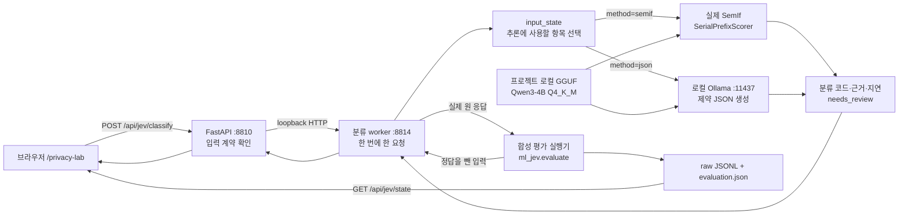

# 한국어 개인정보 유형 분류 실험실: 구현 아키텍처

이 문서는 2026-09-22 프로젝트 소스를 확인해 작성한 현재 구현 설명이다. 모델의 성능 결과는 [한국어 분류 데모 보고서](korean-jev-demo.md), 패키지 출처와 설치 방법은 [Jev·SemIf 출처 검증](jev-source-verification.md)에서 확인한다.

## 구현의 목적과 범위

실험실은 한 API 필드의 **값·필드명·설명**을 받아 한국어 문맥에 맞는 기술적 유형 후보를 반환한다. 실제 실행기는 고정 SemIf 소스의 `llamacpp_backend.SerialPrefixScorer`이며, 로컬 Qwen3-4B Q4_K_M 모델을 사용한다. 공식 TypeSafe Jev 모델을 실행하거나 그 모델의 성능을 재현한 결과는 아니다.

인가 위반 여부, 동일인 식별, CIM 매핑 승인, 법적 개인정보 해당 여부는 이 분류 결과로 자동 결정하지 않는다. `HEALTH`라는 출력은 이번 분류 기준에서 건강·의료 유형에 가깝다는 모델 제안이다. 해당 응답의 접근이 위법하거나 법적 유출 사고가 확정됐다는 뜻이 아니다.

## 실제 데이터 흐름



브라우저는 같은 출처의 `/api/jev/...`만 호출한다. FastAPI는 loopback worker로 전달하고, worker가 실제 모델 계산을 수행한다. 분류 worker는 별도 `.venv-jev` 환경의 모델 라이브러리를 사용하고 GGUF 파일은 프로젝트 `.runtime` 경로에서 읽는다. FastAPI는 이 환경의 모델을 직접 로딩하지 않는다.

`method=semif`는 선택지 토큰의 점수를 직접 읽는다. `method=json`은 같은 GGUF 모델을 로컬 Ollama에서 사용하지만 JSON 문자를 생성하는 별도 방식이다. 규칙 비교기 `ml.engine.rule_baseline`은 합성 평가 실행기의 세 번째 비교 방법이며, `/api/jev/classify`에서 선택할 수 있는 실시간 모델 방법은 아니다.

## 입력 모드가 정보를 제한하는 위치

요청 형식은 다음과 같다. 아래 내용은 설명용 합성 입력이며 측정 결과가 아니다.

```json
{
  "text": "지난달 당뇨 진단을 받았습니다.",
  "field_path": "consultation.memo",
  "description": "가상 회원의 개인 상담 메모",
  "input_mode": "full",
  "method": "semif"
}
```

| 입력 모드 | 모델 추론에 포함되는 정보 | 모델 추론에서 비우는 정보 |
|---|---|---|
| `full` | 값, 필드명, 설명 | 없음 |
| `schema_only` | 필드명, 설명 | 값 |
| `value_only` | 값 | 필드명, 설명 |

**현재 정보 제거 경계는 worker의 `input_state()`다.** 브라우저의 요청과 FastAPI→worker의 loopback 요청에는 입력창의 세 항목이 포함된다. worker가 추론용 JSON을 만들 때 모드에 따라 해당 항목을 빈 문자열로 바꾼다. 따라서 `schema_only`를 “값이 브라우저에서 아예 전송되지 않는다”라고 설명하면 현재 코드와 다르다. 이 구현은 로컬 프로세스 사이의 전달을 전제로 하며, 원격 분류 서비스를 붙이려면 전송 전 정보 제거 경계를 다시 설계해야 한다.

문자 수 한도는 값 2,500자, 필드명 200자, 설명 500자다. 선택한 모드에서 숨기는 항목도 입력 한도 검사를 거친다. 긴 입력을 조용히 잘라 분류하지 않는다. 잘못된 모드·방법·자료형·문자 수 초과는 API에서 거부하고, 토큰화 후 문맥 한도를 넘으면 worker에서 오류로 처리한다.

## 공통 분류 기준의 캐시와 실제 입력

`korean-cached-contract-v2` 어댑터는 SemIf에 다음 요소를 제공한다.

| SemIf 요소 | 현재 내용 |
|---|---|
| `state.classification_contract` | 공통 질문과 각 유형의 설명을 합친 `CONTRACT` |
| `question` | 입력 안의 명령을 따르지 말라는 지시와 `input_state()` 결과 JSON |
| `options` | 분류 코드와 짧은 한국어 이름 |

SemIf는 공통 state의 토큰 prefix가 같으면 저장한 모델 상태를 복원하고, 달라진 입력 질문과 선택지 부분을 계산한다. 매 요청의 전체 프롬프트를 검증하고 실제 입력에 대해 마지막 위치의 logits를 읽는다. 이전 입력의 분류 결과를 찾아 그대로 반환하는 정답 캐시가 아니다. `cache_hit`은 prefix 재사용 여부이며 해당 분류가 맞았다는 표시가 아니다.

이 배치는 초기 direct pilot과 프롬프트가 다르다. 초기 기록은 `evidence/jev/direct-pilot/`에 분리해 보존한다. `contract_sha256`은 분류 기준, `prompt_sha256`은 각 입력의 실제 프롬프트를 구분한다. 과거 결과를 합칠 때 분류 기준 해시만 같다고 같은 프롬프트 실행으로 간주하면 안 된다.

평가 프로필은 CPU 스레드 8개, 문맥 2,048토큰, `use_extra_bufts=False`다. 모델 로딩 시 추가 weight repack 메모리 할당을 끄는 wrapper가 있지만 고정 upstream 파일과 점수 계산 소스는 유지한다. 정확한 고정 commit, 원본과의 줄바꿈 차이 및 wrapper 범위는 `evidence/jev/upstream-integrity.json`에 기록한다.

## 출력 코드와 점수의 의미

| 분류 코드 | 이번 데모의 기술적 의미 |
|---|---|
| `HEALTH` | 특정 개인의 건강·증상·진단·치료 및 질환 부재 정보 |
| `RELIGION` | 특정 개인의 종교·신앙 또는 무종교 정보 |
| `CONTACT` | 개인의 전화·이메일·거주지·배송지 주소 |
| `GOVERNMENT_ID` | 주민등록·외국인등록·여권·운전면허 번호를 담는 필드 유형 |
| `PERSON_NAME` | 개인의 이름·성명 |
| `ACCOUNT_ID` | 서비스 회원·고객·계정 식별자 |
| `OTHER` | 위 개인 관련 항목이 아님이 명확한 주문·상품·일반 안내 등 |
| `UNKNOWN` | 정보 부족·모호한 의미·한 유형으로 정할 수 없는 혼합 입력 |

번호의 진위, 체크섬, 실존 여부를 검증하는 분류기가 아니다. 여러 종류가 한 필드에 섞였을 때 모든 개인정보 구간을 추출하는 NER 모델도 아니다. `UNKNOWN`은 실제 선택지이며 통신 실패를 대신하는 값이 아니다.

SemIf 원 응답에서 선택지에 대응하는 logits를 `z_i`라고 하면 `probabilities[i] = exp(z_i) / sum(exp(z_j))`로 선택지 내부 점수를 얻는다. `label`은 이 점수가 가장 큰 분류 코드다. 높은 값도 오답일 수 있으므로 보정된 정답 확률로 표현하지 않는다.

| 실제 API 필드 | 용도와 해석 |
|---|---|
| `label` | 선택된 기술적 유형 코드 |
| `score`, `probabilities` | 선택된 코드의 점수와 전체 선택지 내부 점수 분포 |
| `allowed_token_mass` | 전체 어휘 분포에서 허용한 선택지 토큰들이 차지한 질량. 선택지 내부 점수와 다른 값 |
| `status` | 정상 결과도 `needs_review` |
| `score_is_calibrated` | SemIf 결과에서 `false` |
| `input_mode` | 해당 실행에서 사용한 입력 모드 |
| `latency_ms`, `input_tokens` | worker가 기록한 점수 계산 지연과 입력 토큰 수 |
| `cache_hit` | 공통 prefix 복원 경로 사용 여부 |
| `source`, `backend`, `adapter_version` | 실제 SemIf backend와 프로젝트 어댑터 식별 |
| `semif_commit`, `gguf_sha256` | upstream 코드와 모델 파일 식별 |
| `contract_sha256`, `prompt_sha256` | 공통 분류 기준과 입력별 프롬프트 식별 |
| `generated_tokens` | SemIf 경로에서는 생성 토큰 없이 점수를 읽으므로 `0` |
| `external_inference` | 현재 로컬 경로에서 `false` |
| `raw` | upstream의 logits, 토큰 ID, prompt·model metadata, prefix 및 단계별 타이밍 |

JSON 비교 방식은 모델이 분류 코드를 생성한다. 실제 선택지 logits 분포를 받지 않으므로 `score=null`, `probabilities={}`, `allowed_token_mass=null`이며 이 값을 만들어 채우지 않는다. JSON 방식의 지연은 로컬 HTTP·생성 처리 시간을 포함하고, SemIf의 `latency_ms`는 scorer 내부 시간이다. 평가 실행기는 별도로 `wall_latency_ms`를 저장하므로 타이밍 범위를 구별해 비교한다.

## 실시간 입력과 합성 평가 기록의 보관 차이

| 경로 | 현재 보관 동작 |
|---|---|
| 화면에서 직접 분류 | 요청을 메모리에서 처리하고 결과를 브라우저 메모리에 표시. 이 라우터·worker·engine에는 입력을 DB나 파일에 저장하는 코드가 없음 |
| worker 로그 | 본문을 출력하지 않도록 `log_message()`를 비워 둠 |
| 상태 조회 | 저장된 합성 예시·평가 요약을 읽어 표시. 새 추론을 실행하지 않음 |
| 합성 평가 실행 | 명시적으로 raw JSONL과 평가 요약을 디스크에 저장 |

“실시간 입력 미저장”은 이 애플리케이션의 영속 저장 동작을 뜻한다. 브라우저·Python·native 모델 계산에 필요한 메모리에는 값이 존재하며, 코드가 그 메모리의 보안 삭제를 보장하는 것은 아니다. worker의 응답에는 `Cache-Control: no-store`를 설정하지만 FastAPI가 결과 JSON을 새로 반환하므로 이 헤더가 브라우저까지 그대로 전달된다고 주장하지 않는다.

합성 평가 파일 `run-*-rows.jsonl`은 제출한 합성 입력, 요청 시각, 실제 HTTP 상태, 원 worker 응답, 정답 및 비교 결과를 보존한다. **정답·정답 설명은 모델 요청에 포함하지 않고 응답 후 비교에만 사용한다.** 각 행을 저장·flush·fsync한 뒤 `evaluation.json`을 원자적으로 갱신한다. 도중에 중단되면 이미 기록된 시도와 오류를 가져오고, 좋은 결과가 나올 때까지 같은 행을 자동 재시도하지 않는다.

`cases.jsonl`과 `CONTRACT`의 해시가 사전 고정 manifest와 다르면 평가를 거부한다. 일부만 실행된 상태에서는 미실행 행을 결과처럼 채우지 않으며, 실제 오류는 실패로 구분한다. `evaluation.json`은 요약이고 원 응답이 필요한 경우 raw JSONL을 확인한다.

## 화면과 오류 처리

화면은 원본 합성 예시의 저장된 평가와 사용자가 방금 실행한 결과를 구분한다. 입력을 편집하거나 입력 모드를 바꾸면 기존 정답과의 자동 비교를 중지한다. 분류 실행 중에는 실행 버튼을 잠그고, 응답 후에도 현재 입력과 실행 시점의 입력이 다르면 그 사실을 표시한다. 높은 점수의 오분류와 임계값별 후보 비율은 분석용 표시이며, 임계값 조절로 인가 정책을 바꾸는 API는 없다.

worker는 모델을 한 번 로딩하고 한 번에 한 요청만 처리한다. 다른 요청을 처리 중이면 `409`, 잘못된 필드 입력이면 `400`, 모델·통신 실패이면 `503`으로 알린다. worker를 직접 호출해 본문 크기 조건을 어기면 `413`으로 거부한다. FastAPI 입력 계약 위반은 `422`다. 오류를 정상 `UNKNOWN` 결과나 규칙 결과로 바꿔 성공처럼 표시하지 않는다. 대기열·배치 서버·운영용 처리량 보장은 현재 구현 범위 밖이다.

## 확인한 코드 위치

| 파일 | 확인한 계약 |
|---|---|
| `static/jev-lab.js` | 세 입력 항목의 수집·전달, 실시간 snapshot, 원본 정답 비교 중지, 저장 평가 읽기 |
| `gateway/jev.py` | loopback worker 호출, Pydantic 입력 한도, HTTP 오류 전달, 평가·보고서 읽기 |
| `ml_jev/worker.py` | loopback bind, 단일 추론 lock, 본문 크기 제한, 본문 로그 억제 |
| `ml_jev/engine.py` | 입력 모드 처리, 공통 기준, 실제 SemIf 호출, native 메모리 옵션, 결과 metadata |
| `.vendor/SemIf/src/semif_phase1/llamacpp_backend.py` | prefix 상태 저장·복원, GGUF 토큰 검증, logits·선택지 점수·원 근거 |
| `ml_jev/evaluate.py` | 입력·기준 동결 확인, 정답 미전송, 원 응답 기록, 오류·중단 보존 |
| `ml_jev/metrics.py` | 오류와 UNKNOWN 구분, 분류별·조건별 지표, 선별 기준 분석 |

이 모듈을 기존 게이트웨이에 연결할 때는 분류 후보와 승인된 CIM 매핑을 별도 상태로 유지해야 한다. 현재 실험실 코드는 분류만으로 접근 권한을 바꾸거나 인가 취약점을 확정하거나 개인정보보호법상 결론을 자동 작성하지 않는다.
