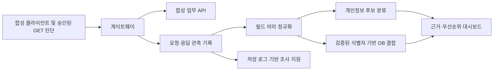

# 교수님 피드백을 데모에 반영하는 방법

## 요구사항과 관측 증거

| 피드백 | 데모의 구현 대상 | 보여줄 증거 | 결론의 한계 |
|---|---|---|---|
| 요청·응답을 별도로 로깅 | 게이트웨이가 합성 API 요청·응답의 안전한 요약과 추적 ID를 DB에 기록 | 이벤트 목록, 실행 ID, 요청자·대상·시각·응답 필드, 실제 저장소 정보 | 게이트웨이를 통과한 관측만 설명 |
| 나중에 AI 기반 침해조사 | 저장 로그의 인가 위반과 정보주체별 노출 항목을 근거 중심으로 집계 | 취약 모드의 조사 보고서와 수정 모드 회귀 결과 | AI가 실제 공격 의도나 전체 침해를 확정하지 않음 |
| alias 필드를 CIM화 | API별 별명 필드를 공통 의미에 매핑; 원본 경로도 보존 | `member_id`·`customer_no` 등의 매핑표와 근거 | 프로젝트 공통 스키마이며 Splunk CIM 호환 인증 아님 |
| Jev 같은 분류 기술을 로컬 시험 | 별도 로컬 분류 후보를 실행하고 규칙 기준선과 비교 | 모델 명칭, 실측 시간, 정답·예측, 실패 사례 | 공식 Jev와 호환 구현·다른 모델을 구분 |
| DB에서 필드 결합 가능성 확인 | 확인된 식별자 영역과 테넌트로 사건을 연결 | 같은 주체의 여러 API에서 노출된 항목 합집합 | 동일인 연결은 법률적 재식별 가능성 확정과 다름 |

실행 완료 여부는 평가 산출물이 결정한다. 이 문서의 ‘구현 대상’은 그 자체로 성공 증거가 아니다.

## 세 가지 문제를 따로 푼다

1. **필드 의미 정규화**: `member_id`와 `customer_no`가 같은 회원 체계의 식별자인지 확인한다. AI는 후보 제안에 사용할 수 있고, 확인된 매핑을 재사용한다.
2. **동일인 기록 연결**: 확인된 식별자 값, 테넌트, 식별자 영역으로 관련 응답을 연결한다. 이름 문자열 일치는 연결 근거로 충분하지 않다.
3. **결합에 따른 식별 위험 판단**: 실제로 공격 주체가 받은 값과 보조 정보의 입수 가능성을 고려한다. 필드명이 함께 존재한다는 사실만으로 법률적 특정 가능성을 확정하지 않는다.

예를 들어 요청자 B가 회원 API와 상담 API에서 각각 A의 이름과 건강 관련 상담 내용을 받았다면 두 응답을 연결해 ‘이 실행에서 B가 A에 관한 항목들을 관측했다’고 설명할 수 있다. 내부 DB에 연결 키가 있더라도 B의 응답에는 그 키가 없었다면, 공격자도 똑같이 결합할 수 있었다고 단정하지 않는다.

## 인가 기준은 업무 정책에서 온다

공개 프로필·공유 문서·관리자 역할·테넌트 경계를 구분한다. 요청자 B가 A의 정보를 본다는 사실만으로 취약점으로 확정하지 않는다. 미등록 정책은 `needs_review`로 남기고 근거 없는 허용·차단 정책을 만들지 않는다. 모델이 분류한 개인정보의 민감도는 접근 권한 그 자체를 결정하지 않는다.

## 사전 진단과 사후 조사의 공통 기반

사전 진단은 테스트 계정으로 실제 안전한 요청을 수행해 취약 가능성을 확인한다. 사후 조사는 이미 저장된 이벤트를 다시 분석한다. 데모의 사건은 합성 시나리오로 생성되며 실제 침해사고가 아니다. 두 기능은 같은 기록을 활용할 수 있지만 결과의 의미는 분리한다.

## 다음 개발을 시작하기 위한 의사결정

- 공개·공유·역할·테넌트 정책을 작은 명세로 고정하고 음성 사례를 유지한다.
- 원본 인증정보를 저장하지 않고도 요청자와 정보주체를 추적할 수 있게 한다.
- 규칙이 잘 푸는 필드는 규칙으로 처리하고 모델은 어려운 별명·문맥 분류에서 실제 개선이 있는지 측정한다.
- 데이터베이스 결합은 명시적인 동일인 근거가 있을 때만 수행한다.
- 실측 오류·지연·누락을 공개한 뒤 적용할 모델과 프로젝트 범위를 정한다.

## 근거

- [Splunk CIM 개요](https://help.splunk.com/en/splunk-cloud-platform/common-information-model/6.4/introduction/overview-of-the-splunk-common-information-model)
- [Splunk 필드 정규화](https://help.splunk.com/en/data-management/common-information-model/6.0/using-the-common-information-model/use-the-cim-to-normalize-data-at-search-time)
- [OWASP API1:2023](https://api-security.owasp.org/editions/2023/en/0xa1-broken-object-level-authorization/)
- [OWASP Logging Cheat Sheet](https://cheatsheetseries.owasp.org/cheatsheets/Logging_Cheat_Sheet.html)

확인일: 2026-09-22. Jev/로컬 후보의 실제 선택과 성능은 별도 모델 실험 산출물을 확인한다.
