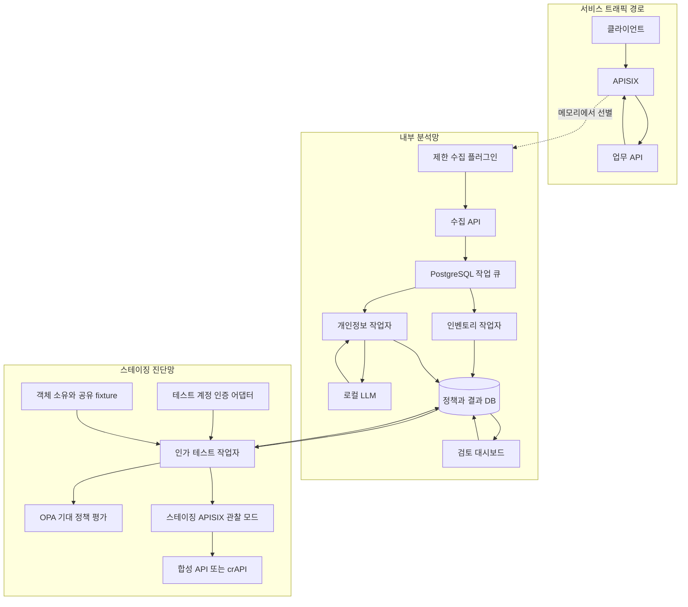

# 아키텍처와 모듈별 구현 계약

2026-09-21 설계안. 아래 서비스 이름·API·스키마는 프로젝트가 구현할 계약이며, 이미 존재하는 제품 API라고 가정하면 안 된다. 설정 예시는 미실행 설계 예시다.

## 1. 구성 선택

| 대안 | 장점 | 추가로 해야 하는 일 | 선택 |
|---|---|---|---|
| APISIX + 자체 분석 서버 | 게이트웨이 기반, 플러그인, 로깅·정책 연동 | 안전한 수집, 업무 정책, 분석·검토 UI | 최종 MVP 기반 |
| mitmproxy reverse + Python addon | 요청·응답 실험과 로컬 디버깅이 간단 | 운영 게이트웨이 수준의 기능 검증 | 초기 비교기 개발용 대체 입력 |
| Envoy + ext_proc | 요청·응답 외부 처리 모드 제공 | gRPC 프로토콜·버퍼링·필터 설정 | 팀에 Envoy 경험이 있을 때 대안 |
| Akto 확장 | API 목록·테스트·민감정보 기능 재사용 가능 | 코드베이스 학습, OSS 제공 범위, 연동·라이선스 확인 | 비교군 또는 후속 결과 가져오기 |

위 장단점과 선택은 구현 복잡도를 고려한 설계 판단이다. 공식 근거: [APISIX](https://apisix.apache.org/docs/apisix/deployment-modes/), [mitmproxy](https://docs.mitmproxy.org/stable/concepts/modes/), [Envoy ext_proc](https://www.envoyproxy.io/docs/envoy/latest/api-v3/extensions/filters/http/ext_proc/v3/processing_mode.proto), [Akto 저장소](https://github.com/akto-api-security/akto)

## 2. 배치 구조



테스트 작업자는 스테이징의 같은 경로를 사용해 증거를 만든다. 최초 취약성 평가에서는 추가 차단 정책을 끈 상태로 앱의 동작을 측정한다. 후속 단계에서 gateway 정책을 적용한 뒤 다시 측정하고, 결과에 `enforcement_mode`를 기록한다. 게이트웨이가 막았다는 사실을 백엔드 취약점이 수정됐다는 사실로 보고하지 않는다.

## 3. 사용자가 처음 설정해야 할 정보

‘설치만 하면 모든 API의 업무 권한을 이해한다’는 도입 방식은 구현 목표에서 제외한다. 최소 입력을 UI로 안내한다.

| 입력 | 용도 | 없을 때의 동작 |
|---|---|---|
| 서비스 주소·라우트·TLS 설정 | 실제 트래픽 경유 | 목록 가져오기만 가능 |
| OpenAPI 또는 관측 트래픽 | operation 식별 | 수동 등록부터 시작 |
| 테스트 계정과 인증 방식 | 타인·역할별 재현 | 수동 관찰, 테스트 NOT_RUN |
| 객체 소유·공유·조직 fixture | 기대 권한 계산 | 관련 케이스 NEEDS_REVIEW |
| 공개/제한 필드와 역할 정책 | 오탐 방지 | 정책 초안 생성 후 검토 |
| 테스트 대상·요청 제한 | 진단 범위 고정 | 작업을 실행하지 않음 |

OpenAPI가 없는 API도 경로·응답 구조 후보는 만들 수 있다. 트래픽에 등장하지 않은 API까지 발견했다고 할 수 없고, OpenAPI `security` 선언만으로 모든 객체 권한이 정의되는 것도 아니다. [OpenAPI 3.1.1](https://spec.openapis.org/oas/v3.1.1.html), [OpenAPI ESS 연구](https://arxiv.org/abs/2212.06606)

## 4. APISIX에서 수집기로 연결하는 방법

### 4.1 첫 수직 구현: 합성 데이터만 사용하는 연결 실험

APISIX의 `http-logger`로 수집 API에 배치 이벤트를 보낸다. `include_resp_body`, 조건식, 본문 최대 바이트 설정을 활용할 수 있다. 다만 사용자 정의 `log_format`과 본문 포함 옵션을 함께 설정하면 본문이 빠질 수 있다는 공식 주의사항이 있다. 선택한 버전에서 실제 이벤트 형태를 확인해야 한다. [http-logger](https://apisix.apache.org/docs/apisix/plugins/http-logger/)

예시 설정의 의미:

```yaml
# 플러그인 설정 조각. 합성 데이터 전용 연결 검증에 사용한다.
http-logger:
  uri: http://collector:8000/internal/events/apisix
  include_req_body: false
  include_resp_body: true
  max_resp_body_bytes: 65536
  timeout: 1
```

이 기본 로깅 설정을 실데이터 운영에 그대로 쓰지 않는다. 기본 이벤트에 인증 헤더·쿠키 등이 들어갈 수 있으므로, 수집기에서 지우는 것만으로는 송신 구간과 중간 버퍼의 원문 노출을 없앨 수 없다.

### 4.2 실제 MVP: `privacy-event-exporter` 플러그인

팀이 구현할 작은 Lua 플러그인은 다음 역할로 제한한다.

1. 요청 시작 시 서버 생성 trace ID, route ID, method, 경로 템플릿, content type을 기록한다.
2. 설정된 JSON 응답만 `body_filter`에서 최대 크기까지 메모리에 복사한다. 클라이언트로 보내는 본문은 바꾸지 않는다.
3. Authorization, Cookie, Set-Cookie, API key, 서명 URL 쿼리 등을 이벤트에 넣지 않는다. 요청 본문은 기본 미수집이다.
4. 응답 종료 후 수집 이벤트를 비동기 배치 전송한다. `body_filter` 안에서 동기 HTTP 호출이나 LLM 호출을 하지 않는다.
5. 정해진 크기를 초과하거나 압축 해제가 지원되지 않으면 `body_state`와 제외 이유를 남긴다.
6. 큐가 가득 차면 이벤트 드롭을 측정한다. 서비스 요청 전체를 LLM 큐가 대기시키지 않는다.

이는 구현 제안이며, Lua phase 제약·필터 순서·gzip·worker 종료 시 유실을 첫 주 PoC로 검증한다. 실데이터 수집 모드가 완성되기 전까지 합성 데이터만 사용한다.

원문 텍스트가 필요한 한국어 분류는 내부 수집기·작업자의 제한된 메모리 경로로 전달한다. 정형 PII와 비밀값은 모델 호출 전에 제거한다. 검토용 최소 발췌만 암호화 보관하고, 전체 원문 저장은 별도 옵션으로 둔다.

### 4.3 본문 수집의 경계

- MVP 지원: 크기 제한 안의 비스트리밍 JSON. 압축·문자셋 지원 여부를 명시한다.
- 압축 전송은 upstream에 `Accept-Encoding: identity`를 사용하는 합성 환경에서 먼저 시작한다. 운영에서도 동일 동작을 가정하지 않는다.
- SSE, WebSocket, gRPC, 이미지·파일, 잘린 JSON은 메타데이터만 수집하고 `UNSUPPORTED` 또는 `TRUNCATED`로 기록한다.
- 응답 미수집은 ‘개인정보 없음’과 다르다.
- TLS는 관리되는 게이트웨이에서 종료하고 필요한 경우 upstream으로 다시 TLS를 연결한다. 암호화된 TCP 통과만으로 HTTP 본문을 분석할 수 없다.
- 사내 서비스가 다른 호스트·포트로 gateway를 우회하면 관측할 수 없다. 적용 라우트와 네트워크 경계를 대시보드에 표시한다.

## 5. 인벤토리

식별 키는 `service_id + HTTP method + path_template`이다. 가능하면 OpenAPI `operationId`를 추가한다.

경로 정규화 우선순위:

1. 등록된 OpenAPI 경로와 일치시키기.
2. APISIX route ID와 수동 템플릿 사용하기.
3. 숫자·UUID 등 후보 구간을 여러 관측에서 일반화하기.
4. `/users/me`, `/users/search`, `/v1`, 날짜·상품명 같은 고정 문자열은 단순 ID 치환에서 제외하기.
5. 불확실한 병합은 후보로 두고 관리자가 승인하기.

원본 쿼리 값 대신 파라미터 이름·타입을 저장한다. 객체 ID가 재현에 필요하면 테스트 fixture 참조를 쓴다. 결과에는 `spec_declared`, `traffic_observed`, `manually_added`를 분리한다. 발견률의 분모는 합성 서비스의 정답 operation 목록으로 고정한다.

## 6. 인가 테스트 작업자

Python HTTP 클라이언트로 구현하며, 계정별 분리된 세션을 쓴다. 사용자에게 전달할 명령에 토큰을 출력하지 않는다.

```text
테스트 계획 생성
 -> 범위와 정책 버전 고정
 -> 테스트 계정 로그인/세션 확인
 -> 소유자 기준 응답 획득
 -> 다른 테스트 계정으로 같은 객체 요청
 -> 정책과 실제 객체/필드 비교
 -> 필요 시 제한된 반복 확인
 -> 마스킹된 재현 근거 저장
```

토큰만 바꾸고 Cookie를 남기면 소유자 세션으로 테스트할 수 있다. 따라서 Authorization, Cookie, CSRF, 사용자·조직 헤더, API key 등 인증 관련 전달 요소를 함께 관리한다. 비회원 요청에서는 모두 제거한다. 계정별 `/me` 등 검증 엔드포인트로 실제 신원을 확인하고, JWT를 단순 decode한 `sub`를 검증된 신원으로 믿지 않는다.

GET도 업무상 부작용이 있을 수 있으므로 ‘GET 전체’를 자동 스캔하지 않는다. `side_effect_free`로 승인한 operation만 기본 실행한다. 쓰기 테스트는 합성 서비스와 초기화 가능한 fixture에서 별도 실행한다.

초기 제안 제한: 서비스별 초당 1요청, 동시 작업 1개, job당 최대 100요청. 로그인·반복·오류 재시도도 예산에 포함한다. 429·연속 5xx·인증 실패에는 중단/보류하며 요청량으로 취약성을 입증하려 하지 않는다.

## 7. OPA의 역할

MVP에서 OPA는 **검토가 끝난 접근 정책으로 테스트의 기대 결과를 계산하는 모듈**이다. `subject`, `action`, `resource`, `context`를 입력하고 기대 허용 여부·허용 필드를 돌려준다. API 호출은 OPA Data API 방식에 맞춘다. [OPA REST API](https://www.openpolicyagent.org/docs/rest-api)

객체 소유자·공유 관계는 테스트 fixture 또는 신뢰 가능한 서버 측 어댑터가 제공한다. 요청자가 임의로 보낸 `owner_id`, `role`, `tenant_id`를 근거로 사용하지 않는다. 현재 응답으로 ‘원래 허용됐을 것’이라는 규칙을 만든 뒤 같은 응답을 검증하면 취약 동작을 정상으로 학습할 수 있다.

실시간 차단을 추가할 때는 APISIX `opa` 플러그인을 활용할 수 있지만, 이 플러그인이 업무 DB의 객체 소유권을 자동 조회해주는 것은 아니다. 별도 컨텍스트 어댑터가 필요하다. 기본 입력의 headers·consumer에는 비밀이 포함될 수 있어 입력 최소화도 필요하다. [APISIX OPA 입력 계약](https://apisix.apache.org/docs/apisix/plugins/opa/)

실시간 enforcement의 기본 정책은 승인된 라우트에 한해 적용한다. OPA 장애 시 보호 라우트는 fail-closed, 관찰 전용 라우트는 기존 서비스 정책을 유지한다. 미확인 정책을 진단 보고서에서 `DENY`로 취급하는 것과는 구분한다.

## 8. LLM 실행 경로

정형 탐지기 결과가 불명확한 한국어 텍스트에만 로컬 LLM을 호출한다. 사용 후보는 Qwen3-8B이며, 최적 모델이라는 결론은 아니다. 모델 카드의 다국어 지원은 이 과제의 한국어 법적 분류 정확도를 보장하지 않으므로 테스트셋에서 선택한다. [Qwen3-8B 모델 카드](https://huggingface.co/Qwen/Qwen3-8B)

Ollama의 JSON Schema 출력 기능을 사용하되, 반환 JSON을 다시 검증한다. 모델의 설명문을 그대로 SQL·Rego·게이트웨이 설정으로 실행하지 않는다. [Ollama structured outputs](https://docs.ollama.com/capabilities/structured-outputs)

모델에는 대상 URL 접속·셸·DB 수정·차단·신고 도구를 제공하지 않는다. API 응답에 들어온 명령문은 분석 데이터다. 입력 길이, 동시 실행, timeout, 재시도 횟수를 제한하고 실패는 `NEEDS_REVIEW`로 남긴다.

캐시는 `service + field path + 내용의 HMAC + 모델 digest + 프롬프트 버전 + 법령 팩 버전`으로 구성한다. 필드명만 같다고 모든 상담 내용을 같은 분류로 재사용하지 않는다. HMAC도 개인정보 보호 조치를 대체하지 않으므로 키를 분리 관리한다.

## 9. 이벤트·저장 계약

대표 이벤트 예시:

```json
{
  "schema_version": "1",
  "event_id": "server-generated-uuid",
  "service_id": "consultation-demo",
  "environment": "staging",
  "traffic_origin": "synthetic_test",
  "test_run_id": "run-001",
  "operation": "GET /consultations/{consultationId}",
  "trace_id": "server-generated-trace",
  "observed_at": "ISO-8601 UTC timestamp",
  "response_status": 200,
  "body_state": "COMPLETE",
  "body_bytes_seen": 420,
  "body_bytes_captured": 420,
  "sample_probability": 1.0,
  "redaction_version": "redaction-v1"
}
```

본문은 별도 내부 메시지 또는 접근 제한된 단기 저장 참조로 연결한다. 이벤트 envelope에는 자격증명·원문 개인정보를 넣지 않는다. `traffic_origin`은 외부 입력 헤더를 그대로 믿지 않고 테스트 작업자의 내부 인증과 job ID로 정한다. 공격자가 테스트로 표시해 집계에서 빠지는 일이 없어야 한다.

권장 테이블:

| 테이블 | 핵심 열 |
|---|---|
| `services`, `operations` | 라우트·관측 범위·명세 출처 |
| `policy_versions` | 본문 hash, 상태, 작성자·검토자, 승인 시각 |
| `test_identities` | 역할·조직, 비밀 저장소 참조; 토큰 원문 금지 |
| `resource_fixtures` | 대상 객체 참조·소유자·공유·공개 범위·시점 |
| `jobs`, `test_runs` | 범위, 버전, 상태, 예산, lease, 오류 |
| `observations` | 응답 메타데이터·완전성·근거 참조 |
| `findings` | 유형·판정·정책 근거·재현 상태·수정 상태 |
| `field_classifications` | JSON path, 개인정보 유형, 근거, 불확실성 |
| `exposure_aggregates` | 기간·출처·중복 제거 방식·하한/미확인 수 |
| `review_events` | 승인·정정·기각 이유와 이력 |

MVP 작업 큐는 PostgreSQL에서 lease와 중복 방지 키를 이용해 구현한다. 다수 메시지 브로커를 처음부터 운영하지 않는다. 처리 실패 작업을 재시도할 때 조회·분류 작업과 상태 변경 테스트의 재실행 정책은 구분한다.

## 10. 제어 API와 화면

프로젝트가 만들 API:

| API | 용도 |
|---|---|
| `POST /services` | 서비스·스테이징 대상 등록 |
| `POST /services/{id}/spec-imports` | OpenAPI 가져오기 |
| `GET /operations` | 관측·명세·분석 범위 확인 |
| `POST /policies/drafts` | 권한표 초안 작성 |
| `POST /policies/{id}/approve` | 검토된 특정 버전 승인 |
| `POST /test-runs` | 승인 대상의 유한한 테스트 실행 |
| `POST /test-runs/{id}/cancel` | 추가 요청 중단 |
| `GET /findings/{id}` | 증거·정책·분류·점수 상세 |
| `POST /findings/{id}/reviews` | 검토 결과 기록 |
| `POST /reports` | 특정 기간·버전의 Markdown 보고서 생성 |

화면은 ① 적용 범위·누락 ② API 목록 ③ 권한표 검토 ④ 취약점 증거 ⑤ 개인정보 분류 ⑥ 우선순위·보고서의 6개로 제한한다. React 등으로 업무 화면을 만들고, 운영 지연·큐 깊이 등 메트릭 화면은 추후 Grafana를 붙일 수 있다.

핵심 결과 행은 `API | 판정 | BOLA/BFLA/BOPLA | 노출 필드 | 법령 분류 | 관측 규모 | 잠재 규모 상태 | 우선순위 범위 | 근거`다. ‘알 수 없음’을 빈 칸이나 0으로 표시하지 않는다.

## 11. 배포와 운영 조건

APISIX의 파일 기반 standalone 구성은 etcd를 생략할 수 있다. 초기에는 이를 선택하고 승인 설정 파일을 읽기 전용으로 mount한다. 관리 화면에서 APISIX Admin API를 직접 외부에 노출하지 않는다. [배포 모드](https://apisix.apache.org/docs/apisix/deployment-modes/)

Compose 구성은 `gateway`, `collector-api`, `analysis-worker`, `test-worker`, `opa`, `postgres`, `dashboard`, `demo-api`를 기본으로 하고 로컬 LLM을 선택적으로 연결한다. 분석 코드와 제어 API는 같은 저장소·이미지를 재사용할 수 있다. crAPI 평가 프로필은 별도로 실행한다.

내부망 설치 패키지에는 고정한 이미지 digest, Python·프런트엔드 lockfile, 모델·인식기 버전, 법령 팩, SBOM, 라이선스 고지, 합성 fixture, 초기화 절차를 포함한다. `latest`를 재현 기준으로 사용하지 않는다. 문서 조사만으로 특정 버전 조합의 동작을 보증하지 않는다.

게이트웨이 원문 수집과 LLM 입력도 개인정보 처리 경로다. 운영 적용 전에는 실제 수집 항목·보유기간·권한을 정해야 한다. 실습 기본값은 합성 데이터, 원문 비저장, 마스킹 증거 7일 삭제로 제안하되 이 기간을 법정 보관기간으로 해석하지 않는다.

## 12. 반드시 검증할 실패 상황

| 상황 | 기대 동작 |
|---|---|
| LLM 중단·응답 스키마 오류 | 정형 탐지는 유지, 문맥 분석만 검토 필요 |
| 수집 큐 포화 | 서비스 전달 유지, 드롭·분석 누락 알림 |
| 토큰 만료·로그인 리디렉션 | 취약점/안전 판정 대신 테스트 불완전 |
| 본문 잘림·파싱 실패 | 개인정보 없음으로 집계 금지 |
| 캐시가 다른 사용자 응답을 반환 | 노출 증거와 cache 상태를 보존, 원인 분류 분리 |
| 외부가 내부 신원·테스트 헤더를 위조 | 제거 후 신뢰 경로에서 재설정 |
| 정책이 실행 중 변경 | 실행 시작 시 고정한 버전 사용 |
| 객체 공유 관계가 바뀜 | 시점 불일치 표시, 새 fixture로 재평가 |
| 결과 DB 장애 | 분석 상태 장애 표시, 자동 재전송으로 쓰기 중복 금지 |

비동기 분석은 이미 나간 응답을 되돌릴 수 없다. 실시간 유출 차단을 주장하려면 별도의 승인된 결정적 정책과 응답 전 버퍼링 경로를 구현하고, 그 경로의 지연·정상 업무 손상까지 따로 평가해야 한다.
