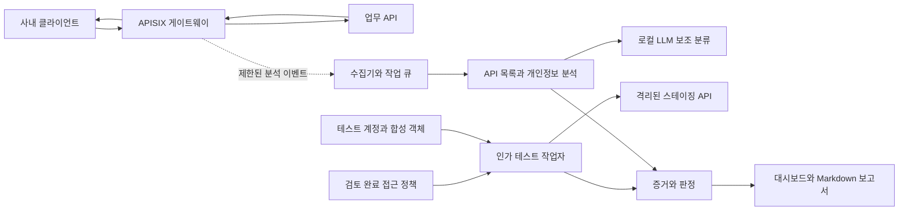

# 내부망 API 보안 게이트웨이 구현 조사 및 제안

작성일: 2026-09-21  
상태: 공식 자료 조사와 구현 설계 완료. 제품 설치·통합·성능 측정은 NOT_RUN.  
일정 가정: 개발 4인, 8주. 실제 인원·기간 확정 전의 제안이다.

## 1. 추천하는 프로젝트 정의

**Apache APISIX 기반 내부망 API 보안 게이트웨이에, 승인된 접근 정책을 이용하는 인가 진단과 한국 개인정보 법령 분류를 연결한 노출 분석 기능을 구현한다. 로컬 LLM은 한국어 비정형 정보 분류와 정책 검토를 보조한다.**

추천 제목:

> 정책 기반 인가 검증과 LLM 개인정보 분석을 결합한 내부망 API 보안 게이트웨이

부제:

> BOLA·BFLA·BOPLA 진단, 한국 개인정보 법령 매핑, 근거 기반 수정 우선순위 지원

게이트웨이 자체의 라우팅·TLS·네트워크 처리를 처음부터 구현하는 것보다, 검증된 게이트웨이 위에 진단·분류·검토 기능을 만드는 구성이 적합하다. APISIX는 요청·응답 로깅과 OPA 연동을 제공한다. 다만 이것만 설치한다고 업무별 소유권·공유 관계나 개인정보 법적 성격을 자동으로 알게 되는 것은 아니다. [APISIX 로깅](https://apisix.apache.org/docs/apisix/plugins/http-logger/), [OPA 연동](https://apisix.apache.org/docs/apisix/plugins/opa/)

## 2. 먼저 바꿔야 하는 가정

| 기존 자료의 주장·방향 | 조사 결과와 수정 방향 |
|---|---|
| 응답의 신원이 토큰 주인과 다르면 위반 | 공개 프로필·공유 문서·관리자·상담 담당자는 정상적으로 타인 정보를 조회한다. 승인된 접근 규칙과 실제 반환 내용을 대조해야 한다. |
| 소유자와 타인의 응답 필드 구성을 비교하면 판정 가능 | 공개 필드가 같아도 정상이고, 필드가 달라도 일부 비공개 정보가 샐 수 있다. 값·대상 객체·필드별 허용 여부까지 확인한다. |
| LLM이 인가 위반 최종 판정 | LLM은 규칙 후보와 설명을 제안한다. 승인된 정책, 테스트 객체의 소유·공유 사실, 재현 증거로 판정한다. |
| 기존 도구는 노출 영향도를 다루지 않음 | Akto는 민감정보 탐지와 위험 점수를 명시하고, Wallarm도 API 위험 점수·민감정보 탐지를 제공한다. 기능 부재를 차별점으로 주장할 수 없다. |
| 한국 개인정보 유형은 모두 새로 구현 | Presidio 문서에 한국 식별번호 인식기가 있다. 재사용 가능성을 검증하고 법적 분류·한국어 문맥·오탐 처리를 확장한다. |
| 개인정보보호법에 따라 위험 점수를 계산 | 법령상 분류와 팀이 만든 우선순위 계산식을 구분한다. 이 문서의 점수는 법정 점수·과징금 계산식이 아니다. |
| 게이트웨이에서 본 응답으로 실제 유출 규모 확정 | 테스트 노출, 관측된 비인가 응답, 잠재 범위를 구분한다. 누락 로그·게이트웨이 우회·중복 정보주체 때문에 전체 규모는 별도 조사가 필요하다. |
| 강남언니 관련 항목이 모두 최고등급이면 검증 성공 | 명확한 건강정보, 일반 상담, 광고 문구, 공개 의료인 프로필, 이미지 URL 등 반례까지 포함해 정확도를 측정한다. |

OWASP도 세션 사용자 ID와 객체 ID를 단순 비교하는 접근이 BOLA 전반을 해결하지 못한다고 설명한다. [OWASP API1](https://api-security.owasp.org/editions/2023/en/0xa1-broken-object-level-authorization/)

기존 제품에 관한 정정 근거: [Akto 민감정보·점수 기능](https://www.akto.io/sensitive-data), [Wallarm 기능 개요](https://docs.wallarm.com/about-wallarm/api-security-overview/), [Presidio 지원 유형](https://presidio.dataprivacystack.org/supported_entities/)

## 3. 만들 시스템의 모습

실시간 트래픽 전달, 비동기 분석, 능동 테스트를 별도 실행 경로로 둔다. 관찰만 하는 모드에서는 테스트 계정 없이도 API 목록·개인정보 후보를 표시한다. BOLA를 재현하려면 적어도 서로 다른 테스트 계정과 접근 규칙이 필요하다.

## 4. 교수님 피드백에 대한 구현 답변

공개 SNS 프로필을 예로 들면, 비회원에게 `/displayName`, `/avatarUrl`을 허용하고 `/email`, `/phone`, `/consultationReason`을 금지하는 필드 정책을 등록한다.

| 요청과 결과 | 판정 |
|---|---|
| B가 A의 공개 프로필을 조회하고 공개 필드만 받음 | 해당 테스트에서 위반 미관측 |
| B가 A의 공개 프로필에서 비공개 이메일까지 받음 | 필드 수준 인가 위반(BOPLA) |
| B가 공유받지 않은 A의 상담 내용을 조회함 | 객체 수준 인가 위반(BOLA) |
| 일반 사용자가 관리자 전용 내보내기 기능을 실행함 | 기능 수준 인가 위반(BFLA) |
| 프로필의 공개 범위와 공유 관계가 확인되지 않음 | 검토 필요. 자동으로 취약·안전 어느 쪽도 확정하지 않음 |

**‘다른 사람 정보인가’보다 ‘이 요청자에게 이 객체의 이 필드를 보여주도록 승인됐는가’가 판정 기준이다.** BOPLA를 포함해야 교수님이 지적한 공개 조회와 비공개 필드 노출을 별도로 설명할 수 있다. [OWASP API3](https://api-security.owasp.org/editions/2023/en/0xa3-broken-object-property-level-authorization/), [API5](https://api-security.owasp.org/editions/2023/en/0xa5-broken-function-level-authorization/)

## 5. 현실적인 MVP 범위

| 반드시 구현 | 후속 확장 |
|---|---|
| REST/JSON API 한 도메인, 약 12개 operation | GraphQL·gRPC·WebSocket·파일 스트리밍 |
| APISIX 트래픽 전달 및 제한된 응답 수집 | 고가용성·대규모 운영·서비스 메시 전체 관측 |
| 소유자·타인·타 조직·관리자·공유 대상·비회원 테스트 | 임의 서비스의 권한 의도를 무설정 자동 복원 |
| BOLA·BFLA·읽기 응답의 BOPLA | 상태 변경 BOPLA와 파괴적 작업 자동 진단 |
| 정형 개인정보와 한국어 텍스트 후보 분류 | 실제 상담 사진의 OCR·비전 분석 |
| 법령 매핑, 증거 열람, 우선순위, Markdown 출력 | 실제 침해사고 전체 규모 확정·신고 자동 제출 |
| 스테이징 재현 및 취약/수정 버전 비교 | 운영망 무인 능동 스캔·LLM 자동 차단 |

사진은 메타데이터만으로 내용을 판정하지 않는다. 첫 버전에서는 `image_content_not_inspected` 상태를 표시하고, 합성 이미지 분석은 텍스트 MVP가 완성된 다음 추가한다.

## 6. 권장 기술 조합과 팀의 개발 기여

| 영역 | 활용할 기반 | 팀이 구현할 부분 |
|---|---|---|
| 게이트웨이 | Apache APISIX, 파일 기반 standalone 구성 | 제한 수집·헤더 제거·진단 트래픽 표식 처리 |
| 제어·분석 서버 | Python FastAPI | 이벤트 계약, 작업 관리, 결과 API |
| 인가 검증 | HTTP 클라이언트 + OPA | 계정·객체 fixture, 정책 계약, 비교·판정 엔진 |
| 개인정보 | Presidio 인식기 | 한국어 문맥 결합, 법령 매핑, 근거·검토 상태 |
| LLM | 로컬 Ollama, 소형 공개 가중치 모델 | 구조화 출력 검증, 보류 처리, 평가셋 |
| 저장 | PostgreSQL | 증거 메타데이터·정책 버전·검토 이력·작업 큐 |
| UI | React/TypeScript | 권한표, 공개 필드 검토, 결과 근거와 우선순위 |
| 배포·평가 | Compose, 합성 상담 서비스, crAPI | 취약/수정 쌍, 정상 예외, 반복 가능한 평가 |

첫 배포에서는 Kafka·벡터 DB·Kubernetes까지 추가하지 않는다. 한 서버에서 구성 요소별 컨테이너를 실행하는 것으로 시작한다. OPA는 우선 테스트의 기대 결과를 계산하는 데 쓰고, 실시간 차단 연동은 후속 단계로 둔다.

## 7. 차별화 주장의 적절한 수준

‘세계 최초 API 개인정보 영향도 도구’라는 주장은 근거가 부족하다. 다음을 구현하고 측정하는 프로젝트로 제시한다.

1. 공개·공유·다중 조직 API에서 신원 비교 방식 대비 오탐을 얼마나 줄이는가.
2. 한국어 상담 문장에서 정형 탐지기 대비 민감정보 후보 탐지율을 얼마나 높이는가.
3. 각 결과를 정책 버전, 실제 응답 필드, 법령 근거, 검토 이력까지 추적할 수 있는가.
4. 설치와 결과 확인이 하나의 내부망 대시보드에서 가능한가.
5. 애매한 사례를 숨기지 않고 검토 대상으로 분리해 담당자의 검토 시간을 줄이는가.

OpenAPI 확장 기반 객체 인가와 다중 계정 BOLA 테스트 자체에도 선행 연구가 있다. 이 프로젝트의 연구 기여는 구체적인 한국어 데이터와 정상 예외에서 측정한 개선으로 제시해야 한다. [OpenAPI ESS](https://arxiv.org/abs/2212.06606), [AuthProbe](https://arxiv.org/abs/2607.20574)

## 8. 교수님께 설명할 수 있는 제안문

> 기존 오픈소스 게이트웨이인 Apache APISIX를 기반으로, API 인벤토리·인가 진단·개인정보 분석·대시보드를 통합하려고 합니다. 인가 진단은 사용자 신원만 비교하지 않고, 공개 범위·소유권·공유 관계·역할·조직 경계가 포함된 승인 정책과 실제 응답을 대조합니다. 공개 프로필 조회는 정상으로 처리하면서 비공개 필드가 함께 반환되는 경우는 BOPLA로 구분합니다. LLM은 비정형 한국어 개인정보 후보 분류와 설명을 보조하고, 최종 인가 판정과 차단은 승인된 규칙을 사용합니다. 개인정보보호법상 분류와 자체 우선순위 점수를 구분하고, 정상 예외를 포함한 합성 서비스와 crAPI에서 정확도·오탐·검토량·성능을 평가하겠습니다.

## 9. 상세 문서

- [01-architecture.md](01-architecture.md): 배치, 신뢰 경계, 수집·저장, 모듈별 구현 계약.
- [02-detection-and-privacy.md](02-detection-and-privacy.md): 권한 규칙 예시, 오탐 방지, 법령·LLM·점수 설계.
- [03-implementation-and-evaluation.md](03-implementation-and-evaluation.md): 8주 일정, 비교 실험, 완료 기준, 첫 개발 작업.
- [04-sources-and-review.md](04-sources-and-review.md): 공식 출처, 경쟁 도구 검토, 첨부 자료 정정표, 확인하지 못한 범위.

## 10. 이번 조사에서 확인한 범위

HTML 2개와 PDF 7쪽의 텍스트를 읽고 PDF 전체 페이지를 렌더링해 확인했다. 원본은 수정하지 않았다. PDF에 적힌 crAPI 성공은 제공 자료의 기록이며, 원본 요청·응답 로그와 환경을 전달받지 않아 이번 조사에서 재현 성공으로 인증하지 않았다.

교수님이 공유한 ChatGPT 링크는 본문을 가져오이지 못했다. `게이트웨이 브리핑.html`이 참조하는 `아키텍처.png`도 같은 폴더에 없었다. 따라서 공유 대화의 전체 선행 솔루션 목록과 누락된 그림을 확인했다고 주장하지 않는다. 제공된 대화, 첨부 본문, 이번에 직접 확인한 공식 자료를 바탕으로 설계했다.
